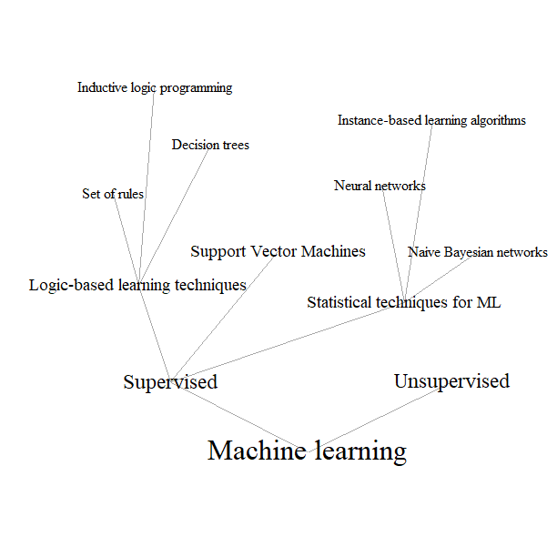
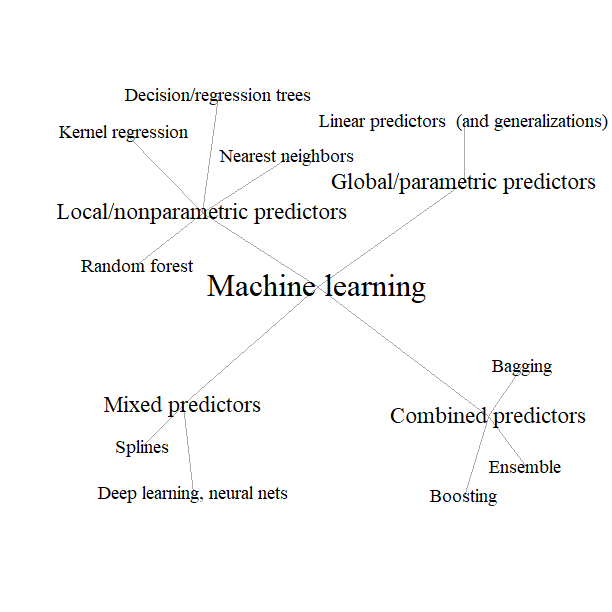

```{r Knitr, echo = FALSE}
#################
# Knitr options #
#################

knitr::opts_chunk$set(
 fig.align = "center",
 # eval = FALSE,
 echo = FALSE
)
```

```{r Packages, echo= FALSE, include = FALSE}
####################
# PAckages and AUX #
####################

# General document wide packages
library(tidyverse)
library(stargazer)
library(arsenal)
library(png)
# Arsenal transformation
source("../../code/arsenal_to_stargazer.R")
```


<!-- ################################################################## -->
<!-- ################################################################## -->
<!-- ################################################################## -->

# The framework design

This section introduces the design and provides an example of available functionality of an integrated experimental framework for model performance exploration. 
In doing so, we strive to reduce and simplify the framework, illustrating the theoretical discussion of the eventual questions that arise during the model evaluation.

There exist multiple ways to provide an illustration for the generalized framework due to its extended flexibility on different levels of scientific procedure. 
Nevertheless, in our work we are attempting to extend this illustrative objective to all the possible levels available by the devised tool-set.
The idea is to demonstrate all the features of different frameworks' layers in the context of a performance comparison. 
First of all, there is a particular interest to demonstrate the advantages of possibility to test different choice settings, providing different artificial datasets for exploration. 
What is more, it would be interesting to contrast different mathematical models and algorithms used to study these datasets and evaluate their performance using different criteria, which will allow for more flexibility.

The work of @llerena2013rose investigates the impacts of the environmental characteristics in the context of a consumer choice of non-alimentary agricultural goods taking roses as an example.
We will inspire ourselves with the context, assumptions and findings of this study and build our work around these pre-sets.
We may be interested to observe how some minor changes in the model may affect the results, which pushes us to consider some simple, yet educative changes in the model.

The organisation of this section is as follows. 
First of all, we introduce in detail the context and discuss which features and characteristics to retain give the @llerena2013rose work. 
We will provide a description of the procedure adopted for this illustration procedure as well.
After brief overview of the original article and delimitation of the general assumptions we will provide a detailed discussion over every single major part of testing framework with extensive argumentation.
Starting with the presentation of the underlying concepts of the decision theories and dataset generation procedure we will continue with a discussion of different modelling techniques and a detailed description of the models to be tested over the artificial dataset. 
Finally, we will provide a panorama of the performance assessment metrics, before switching over to application.


<!-- ################################################################## -->
<!-- ################################################################## -->
<!-- ################################################################## -->


<!-- ################################################################## -->
<!-- ################################################################## -->
<!-- ################################################################## -->

## Context: Willingness to pay for environmental attributes of non-food agricultural products

We choose to use the estimated results of @llerena2013rose as a starting point for our work, copying the context of the study with some minor adjustments. 
In this part we will provide only a general overview of the assumptions made in the article "as is". 
This description will serve us as a reference for future discussion, because afterwards we will be presenting our changes, modifications and additions to these given our needs.

In the article of @llerena2013rose the choice of roses as the non-food agricultural product was determined by several criteria.
Initially, roses were supposed by authors to have characteristics that respect the limitations imposed by the experimental economics.
These are popular widespread products known to all the test subjects, being not easily available at the same time.
What is more, the production of roses have been the object of a growing attention because of potential environmental damages inflicted in the process. 
This last feature made them a perfect product to explore the impacts of the environmental properties on the consumer choice.

Two environmental aspects of roses’ production were explored by @llerena2013rose.
The first one, eco-labelling, described the cultivation environment and conditions, including the use of pesticides, fertilizers, as well as reasonable consumption of water and energy. 
This labelling was adopted shortly before 2010 by some of the producers, who attempted to reduce the harm to environment, to signal their eco-responsible position to consumer. 
Authors mention such dedicated eco-labels as the American *VeriFlora* "Certified Sustainably Grown" label guaranteeing the low environmental impact of roses' production, or the European equivalent: "*Fair Flowers Fair Plants*" (FFP) label certifying the environmental performance of agricultures by several criteria such as the "*fertilizer use, crop production, energy efficiency, waste management and a number of social requirements*". <!-- [@llerena2013rose, pp. 33-35]. -->
The second chosen environmental feature of roses was their carbon footprint, measured by the greenhouse gases emissions during the cultivation and transportation. 
This criteria being particularly important because of an increase of roses production in developing countries in Africa, South America and Asia, which are later sold on the European market, resulting in immense amount of CO2 emissions during the transportation.

The authors assumed that the individuals had heterogeneous preferences for the environmental attributes of roses. 
In other words, it was assumed that each individual had his personal attitude to the eco-label and carbon footprint of the roses, determined by their awareness of the environmental issues. 
The experimental design took into account this assumed dimension through observation of multiple simultaneous choices for each of the subjects in order to capture individual specific elements.
To model such complex repeated choice framework, authors used well developed RUM behavioural theory [@mcfadden2001ec] paired with the power of the mixed logit model, which is a generalisation of a simple logit model, allowing for more flexibility, such as random effects modelling.

The assumptions made by the researchers may be roughly divided into two categories, which will define the structure of this section.
First one comprises the behavioural assumptions concerning the decision-making procedure, which encompasses the different restrictions on the experimental design, individual's behavioural strategy and choice preferences, which aim at elimination of various behavioural biases and simplification of future mathematical analysis and data treatment.
The second regroups the assumptions related to the modelling process.
It encompasses theoretical assumptions imposing restrictions on the mathematical model, its choice and estimation techniques.
Finally, we present the target effects computed by the researchers in the context of the study, as the main objective was not the general approximation and modelling of a consumer choice, but rather extraction of particular values of interest such as willingness to pay for the alternatives' attributes.


<!-- ################################################################## -->
<!-- ################################################################## -->
<!-- ################################################################## -->

### Experimental design

First of all, we should start with a description of the experimental design framework introduced by the authors in order to obtain valid results. 
This would allow to correctly implement such complex econometric model as mixed logit on the next stage. 
The experimental design assumed that individuals make their decisions based on the perceived utility of a particular alternative, following the traditional restrictions described by @mcfadden2001ec.

<!-- Cela devient difficile à suivre sans avoir eu un abstract du papier - sur la partie méthodo.
Je pense que vous pouvez ajouter cela dans la section précédente. peut être avant le paragraphe "the assumptions made..." : vous décrivez le déroulé: modèle théorique comportemental + design XP => RUM: mixed logit . Puis vous énoncez les 2 groupes d'hypothèses. Vous pouvez notamment rappelez que la connexion entre ces 2 ensembles d'hypothèses est la possibilité de déduire des WTP -->

Because the study collected data through a controlled experiment setting, some restrictions were imposed on the observed characteristics in order to simplify the analysis.
The roses, as available alternatives, were defined by three attributes observed by subjects:

- the FFP EU eco-label (*Label*)
- the carbon footprint (*Carbon*)
- the price (*Price*)

These attributes varied across the available options of the alternatives present in different choice sets. 
Precise written instructions were transmitted to the subjects making available information about the criteria certified by the FFP labelling as well as some briefing about the organization issuing this labels (the Horticultural Commodity Board). 
These data-sheets provided as well a summary of Cranfield University’s report about roses’ carbon footprint. 
Both these attributes (eco-label and carbon footprint) were understood as a binary variables valuing 0 or 1 depending on the presence of a particular attribute for a particular rose.
Finally, in addition to the two environmental attributes, a price was introduced into experimental design, which varied by 0.50€ between 1.50€ and 4.50€, creating this way a seven level factor.
The table \ref{tab:attributes} regroups the main characteristics for these variables.

\begin{table}[!htbp] \centering 
 \caption{Alternatives' attributes} 
 \label{tab:attributes} 
\begin{tabular}{@{\extracolsep{5pt}}lcccccc} 
\\[-1.8ex]\hline 
\hline \\[-1.8ex] 
Statistic & \multicolumn{1}{c}{Levels} & \multicolumn{1}{c}{Min} & \multicolumn{1}{c}{Max} & \multicolumn{1}{c}{Step} \\ 
\hline \\[-1.8ex] 
Price & 7 & 1.5€ & 4.5€ & 0.5€\\ 
Label & 2 & 0 & 1 & 1 \\ 
Carbon & 2 & 0 & 1 & 1 \\
\hline \\[-1.8ex] 
\end{tabular} 
\end{table} 

In order to avoid the substitution bias^[The substitution bias occurs when the individuals tend to switch to the less expensive alternative available, given the relative prices changes. 
In the experiment context, the customers might have preferred to buy identically priced roses in a better placed store, instead of waiting for bought in experiment roses to be delivered.] 
as the subjects might have decided to purchase a rose for the experiment somewhere else for a lower price rather than in the laboratory a special measure was introduced into experimental design.
In the experimental literature the implemented method is known as the "*field price censoring*", which means that the values used in the laboratory are censored according to the field market price [@harrison2004experimental]. 

The elicitation of the individual preferences for the different roses' attributes was ensured through a combination of discrete choice questions and real economic incentives.
The stated choice surveys are a popular choice for study of consumer preferences for public and private goods. 
The discrete choice methodology and experimental design setting provides the advantage to vary several attributes of a particular product and to estimate the marginal rates of substitution between these attributes. 
A particular accent was made on the derivation of the willingness to pay (WTP) for specified features of interest.
This tool provides a great flexibility, allowing to test different scenarios all of which could be presented in a single study, although, there is always a danger that the choices made by consumers in experimental surveys might not reflect their real preferences. 
The participants to hypothetical surveys were generally stating higher WTP values for private and public goods, leading to a potential bias in the estimates when compared to the real world. 
Following this reasoning the authors have introduced incentives into their choice experiment linking this way the participants’ decisions to real consequences by resulting in acquisition of randomly chosen alternative from the pool of chosen alternatives. 

The choice set generation was devised with intention to resemble to maximum the actual purchase decisions with the inclusion of a "*do not buy*" option, in order not to force the subjects to buy anything.
In other words, the presence of such alternative ensured that subjects were never pushed to purchase a rose, imitating this way a real shopping situation, when consumers always have the possibility of not purchasing any roses if none of the alternatives suited them in a particular choice set.
Consumers were asked to make twelve different choices displayed. 

In the case of prices allocation random design techniques were used to configure the subsets of choice sets among subjects. 
The two level factors standing for the roses' environmental attributes could be regrouped into four different combinations defining four types of roses. 
The experimental design introduced the roses in pairs to subjects, creating this way several three alternatives choice sets. 
Even though the different combinations of two roses potentially create sixteen different alternative pairs, the authors limited their search to six completely different pairs of roses. 
The resulting experimental sets of six choice sets were repeated twice resulting in twelve cards, which were then introduced to subjects. 
All the cards were distributed simultaneously so that consumers could make their choices in any order. 
Individuals were informed from the beginning that one of their decisions would be randomly drawn at the end of the experiment. 
Finally, the random draw resulted in the purchase of a real rose offered against payment, this condition ensured that the subjects considered each choice made during the experiment as a real purchase decision, weighting carefully the available alternatives. 

Generic titles were randomly allocated to the roses within choice sets: rose A and rose B respectively. 
Such "*unbranded*" alternatives' titles allowed to ensure that they can only be differentiated according to their attribute combinations.
This way the choice between a "*Rose A*" and a "*Rose B*" can only be defined by their attributes alone (Label, Carbon footprint and Price), but not by their label.
The same strategy applied to prices, which were randomly assigned to the alternatives within the choice sets by a random number generator setting prices within the defined limits.

<!-- Ce qu'il manque à cette section c'est: à quoi sert cette section ?
Un paragraphe concluant en disant: donc on va simuler une situation de choix répétée, sans label avec l'option d'opt-out 3 attributs, etc. me semble une première conclusion de cette section ? -->

Taking into account the experimental design we are going to follow the authors' ideas in simulating an identical experimental design with statistical methods available. 
The artificial choice situation will assume three alternatives: two unlabelled ones doted with a common utility function, while the third is the baseline alternative of "no choice" option. 
In order to study the heterogeneity of the individual preferences the subjects should be placed in a situation of repeated choice, facing several choice situation. 
The alternatives will be described by three attributes, while individuals will be distinguished by four characteristics.


<!-- ################################################################## -->
<!-- ################################################################## -->
<!-- ################################################################## -->

### Econometric model 

Consumers' decisions are analysed with the discrete choice framework based on the utility maximisation assumption. 
This framework assumes that consumers associate each alternative in a choice set with a utility level and choose the option, which maximises this utility. 
The general estimation framework of the Random Utility Model (RUM) proposed by @mcfadden1974utd provides the opportunity to estimate the effects of product attributes and individual characteristics and to compute willingness to pay indicators.

Authors implemented the mixed logistic regression with random, correlated attributes' effects to estimate the willingness to pay of the individuals for each of the explored attributes of a rose.
The mixed logit model takes into account the repeated nature of the choices made by the respondents.
This model relaxes the Independence from Irrelevant Alternatives (IIA) hypothesis of the more traditional multinomial logit, allowing the random components of the alternatives to be correlated, at the same time the error terms are still considered to be identically distributed [@greene2008econometric]. 
The alternative specific parameters are assumed to be randomly distributed across the population contrary to the fixed parameters specification for a traditional multinomial logit model.
In other words, the mixed logit model provides the opportunity to consider heterogeneous effects among individuals by allowing taste parameters to vary in the population.
The authors suppose that the random taste heterogeneity should be evident in response to the eco-label and the carbon footprint attributes of the roses, because of different level of environmental awareness across population.
Following the ideas of @bernard2009organic the authors introduce the cross-product for eco-labelling and carbon footprint as a random parameter as well in attempt to test the effect of the simultaneous presence of both of these attributes on consumer choice. 
This addition results in a total of four random parameters to be estimated: the two parameters describing roses attributes, their cross-product and the "*Buy*" option dummy variable which captures heterogeneity in consumers’ preferences for a rose.
All of the random parameters associated with the roses’ attributes are assumed to follow normal distribution, which is traditional for the procedure of mixed logit modelling. 
Given that the normal distribution is symmetric and unbounded, the resulting model allows for both positive and negative effects to exist inside population.
To simplify the analysis and assuming the reasoning of @revelt1998mixed, the authors restrict the price coefficient to be fixed in the population. 
Such choice of price's effects specification ensures that all respondents have a negative price coefficient, leading to a normally distributed estimate of willingness to pay. 

The systematic part of the utility relatively to the "No buy" option was expressed through a linear in parameters form:

\begin{multline}
V_{ij} = \alpha_{i,Buy} + \beta_{Buy, Sex} Sex_i + \beta_{Buy, Age} Age_i + \beta_{Buy, Income} Income_i + \beta_{Buy, Habit} Habit_i + \\
+ \gamma_{Price} Price_{ij} + \gamma_{i, Label} Label_{ij} + \gamma_{i, Carbon} Carbon_{ij} + \gamma_{i, Label \times Carbon} Label \times Carbon_{ij}
\end{multline}

Where $j$ was an alternative among the available choice set of three options: buy rose A, buy rose B or do not buy anything.
The dummy variable $\alpha_{i,Buy}$ was introduced to capture the effect of a decision to buy a rose, while the vectors of $\beta$ and $\gamma$ regrouped the effect of individual characteristics and the attributes of alternatives respectively.

In their article @llerena2013rose did not provide an extensive demonstration or description of the model selection procedure. 
What is more, we have little information as to what model comparison and validation techniques were implemented.
Only the final model, chosen by authors, was presented to us, which brings some limitations for our study. 

In the end of this subsection, it is important to highlight that the mixed logit models are usually specified with uncorrelated random effects, although it's not the case in the context of this particular study.
The authors introduce correlation between the normally distributed alternative specific coefficients: $\alpha_{i,Buy}$, $\gamma_{i, Label}$, $\gamma_{i, Carbon}$ and $\gamma_{i, Label \times Carbon}$. 


<!-- ################################################################## -->
<!-- ################################################################## -->
<!-- ################################################################## -->

### Willingness to pay and premiums

<!-- Ok, il faut aussi rappeler que la question est d'estimer un modèle pré-supposé, presque entièrement spécifié. De mémoire, on teste les coeef aléatoires, les corrélations des coef aléatoires, le mixed vs MNL, mais la fonction d'utilité et les variables sont presque imposées par la question de recherche

Il serait intéressant pour cette section de lister les hypothèses que vous conservez ou non dans cette étude et celles qui pourraient être testées, comme par exemple l'effet aléatoire pour le prix ? l'effet d'ordre A vs B, ou l'effet entre le choix 1 et le choix 12, etc -->

The only target metrics present in the article were the willingness to pay (WTP) and premiums for particular attributes. 
The former could be read as the value the consumers are willing to pay for a rose. 
The latter may be translated as how much consumers are ready to pay for a unit change of a given attribute of the product.
Both the WTP for a product and the premiums can be computed as the marginal rates of substitution between the quantity expressed by the attributes and the price [@louviere2000stated].
The WTP for a rose in this case could be expressed as:

\begin{equation}
WTP = \frac{
 \frac{\Delta V}{\Delta BUY}
}{
 \frac{\Delta V}{\Delta Price}
} = \frac{
  - \alpha_{Buy}
}{
  \beta_{Price}
}
\end{equation}

Where $\frac{\Delta V}{\Delta BUY}$ is the difference in the relative utility $V$ associated with the "Buy" and "No buy" choices.
The premiums for the particular attributes $Z_k$ of a given product could be identically expressed as:

\begin{equation}
WTP = \frac{
 \frac{\Delta V}{\Delta Z_k}
}{
 \frac{\Delta V}{\Delta Price}
}
\end{equation}

Since the random parameters of the utility function were assumed to be correlated, authors used Krinsky and Robb parametric bootstrapping method [@krinsky1986approximating] with 1000 draws to estimate the standard deviations and confidence intervals for these parameters.


<!-- ################################################################## -->
<!-- ################################################################## -->
<!-- ################################################################## -->


<!-- ################################################################## -->
<!-- ################################################################## -->
<!-- ################################################################## -->

## Theories of consumer choice

<!-- As the decision making modelling procedure is directly intertwined to the behavioural domain studies, which attempt to describe and model the process of decision making, it is simply impossible to omit the various theoretical aspects specific to this field.
There already appear studies exploring and comparing the context aware models against context-free ones (@belgiawan2019cdm), providing evidence of the advantages of the former.
The economic decision theory derives mostly from the random utility theory (RUM) of @mcfadden1974utd and more recently of @mcfadden2001ec, that were recently challenged by alternative visions such as random regret minimisation theory (RRM) of @chorus2010rrm, with a related relative advantage maximisation theory (RAM) of @leong2015ram, or even quantum decision theory (QDT) of @yukalov2017quantum, which offers a wide range of tools for modelling under uncertainty. -->

Once we have presented the assumed context for this study, we will dive further into details and present all the key behavioural elements of this work one by one. 
In this section we are going to present in detail the questions and problematic associated with the behavioural modelling of the consumer choice. 
Particularly, we are going to introduce the terminology to be used in this work, some of which was already partially presented in the previous section.


<!-- ################################################################## -->
<!-- ################################################################## -->
<!-- ################################################################## -->

### General terminology

For the presentation of general methodology we are going to adopt the ideas of @depalma2011tr, introducing this way the principal concepts and main components of the decision theory.
Traditionally it comprises several components: 
the decision makers or *individuals*, described by their characteristics; 
a set (or sets) of available *alternatives*, defined by their attributes; 
and a decision rule or set of rules, describing the procedure adopted by the individuals to make actual decisions. 

The individuals are supposed to have different tastes, and therefore we must explicitly treat the differences in the decision-making processes among individuals, doted with different characteristics. 
Therefore the characteristics $X_i$ of the decision maker $i$ constitute an important part of the problem.

The decision maker chooses from a finite and countable set of alternatives $\{\omega_i, \dots, \omega_j\}$, which consists of the entire *universal set of alternatives* $\{\omega_1, \dots, \omega_r \} \in \Omega$ as defined by the particular choice environment. 
A decision maker $i$ may only consider a subset of this universal set $\Omega$, and this consideration set is conventionally named *a choice set* $\Omega_i$. 
In discrete choice analysis, each alternative $\omega_j$ is characterized by its attributes $Z_j$. 
For example, in the particular case study the observed attributes of roses are their price, the eco-label and the relative carbon footprint. 
Decision makers evaluate the attractiveness of an alternative based on these attribute values before making their choice. 

Finally, the decision rule describes the process by which the decision maker $i$ evaluates the available information $Z_j \forall \omega_j \in \Omega_i$ and arrives at a unique choice. 
There is a wide range of available decision rules, including dominance, satisfaction, lexicographic, elimination by aspect, habitual, imitation, and utility [@depalma2011tr]. 
However, only the latter class is most often associated with discrete choice analysis because to its extensive use in the consumer choice behaviour modelling. 
The utility theory takes its roots from the microeconomic consumer theory and is adjusted according to the needs of the modeller. 
A utility $U_{ij}$ represents the attractiveness of a particular alternative $\omega_j$ for a particular individual $j$ in a scalar form.


<!-- ################################################################## -->
<!-- ################################################################## -->
<!-- ################################################################## -->

### Random utility maximisation models

<!-- This particular discrete choice theoretical model consider a choice from feasible sets $\Omega_i$ containing finite numbers of mutually exclusive and exhaustive alternatives that are characterized by their observed attributes $Z_j$, with other aspects of consumer behaviour taking place in the background. 
The level of utility $U_ij$ attained is a function of the attributes $Z_j$ of the discrete alternative $\omega_j$, consumer characteristics $X_i$, a uniformly distributed random vector characterizing unobserved characteristics and attributes $\eta$.  -->
The random utility maximisation models (RUM) were introduced and developed by @mcfadden1974utd. 
The theory of optimization implies that this is a classical indirect utility function, with the following properties: "*it has a closed graph and is quasi-convex and homogeneous of degree zero in the economic variables*" [@mcfadden2001ec]. 
The last element in applying the standard model to discrete choice is to require the consumer's choice among the feasible alternatives to maximize conditional indirect utility based on some reference alternative, rather than absolute utility.

In our work we use the notation introduced by @bhat1995evm and later adopted by @cascetta2009tr when representing the utility functions as they are more simple and easy to understand compared to initial @mcfadden1974utd specification.
The functional form of the canonical indirect utility function depends on the structure of preferences, including the trade-off between different available alternatives. 
The perceived utility $U_{ij}$ can be expressed as the sum of two terms: a systematic utility and a random residual term: 

\begin{equation}
U_{ij} = V_{ij} + \eta_{ij}
\end{equation}

Where $U_{ij}$ stand for utility, $V_{ij}$ at the same time represent its deterministic part defined by some fixed deterministic function and $\eta_{ij}$ reflects some unobserved random effects.
The latter having being a random variable following Gumble distribution, parametrized with $(\mu = 0, \theta = 1)$, which may be interpreted as:

\begin{equation}
\eta_{ij} = - log( - log(\epsilon_{ij}))
\end{equation}

With $\epsilon_{ij}$ a variable uniformly distributed and independent across alternatives, the disturbances are independently identically distributed Extreme Values (EV). 
This produces a MNL model in which the systematic utility has a linear in parameters form for each alternative $\omega_j \in \Omega$.
The systematic utility $V_{ij}$ represents the mean utility perceived by all decision-makers having the same choice context decision-maker. 

\begin{equation}
V_{ij} = f(X_i, X_j) + \eta_{ij}
\end{equation}

Traditionally in the most simple models this deterministic utility part is represented by some linear in parameters function:

\begin{equation}
f(X_i, Z_j) = \alpha_j + \beta_j X_i + \gamma Z_j
\end{equation}

One family of RUM-consistent discrete choice models that is very flexible is the random parameters or mixed multinomial logit (MMNL or more often denoted as ML) model, which is used in the @llerena2013rose work.
The random parameters set-up assumes $\gamma$ effects to be randomly distributed across individuals, usually following normal random distribution. 
In some cases, these parameters may be assumed to be correlated, which potentially reflects better the real world. 

<!-- il faudrait évoquer la corrélation des coef ?
De fait on pourrait tester 1) coef non aléatoires, 2) coef aléatoires indépendant 3) coef aléatoires corrélés -->

In our study we are going to explore two equally possible in real life specification for data generation procedure: one assuming random effects for alternative specific variables and another keeping these parameters fixed.
Speaking about the utility definition, we assume, that the work of @llerena2013rose managed to obtain correct estimates for a relative utility function of roses and we take this particular function structure in order to generate utilities for a given dataset. 
This assumption will offer us a baseline and target effects' values to compare our estimation with. 

<!-- ceci est correct, mais peut précis, cela pourrait être dit plus tôt, avant les sections qui détaillent les choix que vous avez faits -->


<!-- ################################################################## -->
<!-- ################################################################## -->
<!-- ################################################################## -->


<!-- ################################################################## -->
<!-- ################################################################## -->
<!-- ################################################################## -->

## Different datasets available in research

There exist numerous difficult questions related to the models' comparison task such as performance measures' choice or models' specification, but beforehand there always stand the data related questions. 
It is due to the fact that all the other questions and the validity of the obtained responses rely entirely on the choice of the inputs and the data available.
Many of the existing applied econometrics papers use the most simple specification of the Multinomial Logistic Regression (MNL), that may lead to erroneous results and conclusions.

Many of the models' performances and performance measures depend on the dataset properties and the particular application case. 
This means that in comparison of different mathematical models, implementing some complex tools such as a neural network models (NN), for example, we should pay attention to use appropriate data-model to estimate such model.
This particular problem, as many others related to the models' performance evaluation, was extensively described by @japkowicz2011el.

When it comes to model comparison, the additional requirements arise to the validation datasets and we should find answers to several questions:

- What datasets should be used? 
- Should the model be validated on one dataset or several several?
- Should a synthetic or real-world data be used?
- If several dataset are chosen, which ones should be used on different validation steps? 
- How the algorithms should be tuned face to the dataset selection?
- What properties the studied data should have?

Moreover, different models may require different data adaptation methods to be implemented.
For example, the popular  multinomial logistic regression allows to take into account the individual characteristics as well as the attributes of the various alternatives issued from some limited set. 
The ML approaches, such as Support Vector Machines or Linear Discriminant Analysis does not allow such flexibility. 
For these models, even if we can represent each point in the modelled space as a combination of individual characteristics and attributes of alternatives, we can only classify the instances by iterative binary separation [@tsoumakas2007cm].
Consequently, the questions of the dataset properties arises, which are tightly intertwined with the available models choice and the implemented learning techniques. 

<!-- la question de ce paragraphe est importante, pourtant la conclusion du paragraphe n'est pas évidente par rapport à ce que vous allez faire ensuite -->

In this section we will discuss the different existing approaches to data management in theory testing and hypothesis verification. 
Firstly, we will present the general questions and problematics. 
Then a solution to be implemented in this particular study will be described and discussed.


<!-- ################################################################## -->
<!-- ################################################################## -->
<!-- ################################################################## -->

### Theoretical concerns in dataset selection

The data related problematic arise firstly during model generation step of the standard statistical learning procedure and persists till the stage of the model comparison.
Speaking about the model validation, the usual *rule of thumb* approach is the cross-validation technique, although some advanced users suggest that this method may not be always appropriate [@japkowicz2011el].
In econometrics, for example, as well as in many other applied disciplines, researches tend to oversimplify the validation step by completely avoiding this important step, or by performing only *single-fold* validation.
On the other hand, many advanced statistical model and ML methods require a separate tuning step during model set-up, which alone requires verification and validation on some dataset.
It remains questionable whether the overall model validation dataset and the dataset used for fine tuning should be the same or not. 

Of particular interest for our study is the ongoing discussion between two sides of the statisticians' community, mentioned by @japkowicz2011el, about whether the algorithms and statistical models should be compared over the real world datasets or using some synthetically generated data.
On one hand, the datasets composed of the observations or obtained through controlled experiments perfectly reflect the real world situation, being at the same time too case specific.
In other words, it is always dubious that a model or a theory verified for one particular real dataset has any external validity. 
The obtained insights can rarely be extended over a larger population.
Artificial data can be designed in a controlled manner to study specific aspects of the performance of algorithms and models.
Moreover, the artificial data is highly useful for testing particular theories, for example, the behavioural theories or their impact on different models. 
Consequently such data may allow for tighter control, which gives rise to more carefully constructed and more enlightening experiments. 
Although, the real data are hard to obtain and are difficult to analyse, the artificial data introduces the danger of the problem's oversimplification. 
In our case study these features are of utmost importance, because, given the framework, the artificial data enables us to test desired hypothesis in a controlled environment.

<!-- Je n'aime pas beaucoup la structure de ce paragraphe.
Vous mettez trop d'emphase sur le débat alors que son traitement se réduit à 10 lignes.
Dans cette section, il faudrait justifier le choix de la simulation, par le fait que l'on ne sait pas comment sont influencés les préférences hétérogènes des individus dans la réalité. Même avec un cadre expérimental il serait difficile de contrôler ces "coef aléatoires". mais une note de bas de page (ou simplement la conclusion) pourrait rappeler que l'expérimentation permettrait d'avoir des données réelles pour tester une hytpothèse bien choisie (mais qu'il reste à identifier...) -->

Generation of synthetic datasets is a common practice in many research areas. 
Such data is often generated to meet specific needs or certain conditions that may not be easily found in the original, real data. 
The nature of the data varies according to the application filed and includes text, graphs, social or weather data, among many others. 
In this particular work we, for example, face the consumer choice data, which describes individuals and their choice sets.  
The common process to create such synthetic datasets is to implement small scripts or programs, restricted to limited problems or to a specific application.

As @garrow2010gs points it out, even observing the growing use of artificial data in discrete choice and classification analysis, "little is known about how the methodology used to generate synthetic datasets influences the properties of parameter estimates and the validity of results based on these estimates". 
That is, there are two potential sources of biases when using synthetic discrete choice data: 

- The unknown effect of the dataset generation method; 
- The parameter estimation bias.

The first one is rather complex and has many different element, that could potentially affect the estimated results. 
There exist different methods for artificial dataset generation, starting with use of *robots* (artificial observation instances) and ending with Markov Chains Monte Carlo simulation and Neural Network use. 
One of the most evident errors in this case could arise from the fact, that the closer the estimated model is to the model implemented to generate the dataset, the better would be the observed results, which may not be true in the real world. 

The second bias arises in the situation where the real world parameters are used to generate artificial dataset, exactly as in this particular work. 
The potential difference between the ideal simulated situation and the real world situation lead to different choice structures. 
The theoretical model supporting the data-generation process may be potentially erroneous, leading to erroneous conclusions if only such dataset was used for incorrect purpose. 

<!-- il faudrait expliquer les 2 points suivant
les sous sections suivantes portent le nom de ces biais, on a l'impression qu'ils vont être expliqués plus en détail. Mais en fait non, vous partez sur ce que vous allez faire et comment -->


<!-- ################################################################## -->
<!-- ################################################################## -->
<!-- ################################################################## -->

### Artificial dataset generation procedure

For the objectives of this study we assume the best option is to generate our own artificial dataset based on a predefined utility function and given a predetermined statistical properties for individual characteristics and alternatives' attributes.
Such set-up ensures that we know exactly the data generation process and have all the control over the parameters and experimental design. 
As was mentioned above, this choice may be dangerous in terms of justification of the resulting external validity of obtained results in application to any other real world dataset.
However we ensure this way, that the obtained results could be potentially compared with the baseline target parameters and the initial effects are observed to us. 

First step in the dataset generation is the generation of the experimental design framework, imitating the original choice set-up, as described in the @llerena2013rose article. 
Our first steps are identical to the original work, as we start with the generation of all possible combinations of binary factors for our alternatives: roses described by two binary attributes and their price. 
There exists only four different roses types, if described by their binary attributes alone, as can be seen in the table \ref{tab:comb1}.

\begin{table}[!htbp] \centering 
 \caption{Possible attributes of roses} 
 \label{tab:comb1} 
\begin{tabular}{@{\extracolsep{5pt}}ccc} 
\\[-1.8ex]\hline 
\hline \\[-1.8ex] 
Type & \multicolumn{1}{c}{Eco-label} & \multicolumn{1}{c}{Carbon footprint} \\ 
\hline \\[-1.8ex] 
1 & 0 & 0 \\
2 & 0 & 1 \\
3 & 1 & 0 \\
4 & 1 & 1 \\
\hline \\[-1.8ex] 
\end{tabular} 
\end{table} 

Given a multiple choice context when an individual is choosing among three alternatives: two different roses, defined by labels A and B; and a "No buy" option.
Consequently there exist multiple possibilities to regroup two roses into a choice set, for instance, in @llerena2013rose are generating six choice sets ensuring that roses in a given choice set always have different attributes, while in practice there exist sixteen possible combination of two roses given they are described by two binary factor variables.
The choice of the choice set delimitation in the article could be understood as the individuals participating in the stated choice experiment are scarcely interested in answering multiple questions, while six or twelve choices to consider appear to be a reasonable number.
On the contrary, our experimental artificial set-up allows to ask as many questions to as many individuals as we want.
For example we can generate $7 \times 4 \times 7 \times 4 = 784$ choice sets for each individual, containing all the possible combination of two different roses, each described by two binary factor attributes as well as their price, which has 7 different levels (varying by 0.50€ in a range from 1.50€ to 4.50€).
However, such excessive set-up can have its toll on the computation times, being in the same time absolutely unreasonable and unrealistic, were we to replicate our results in a stated choice experiment. 
Consequently, for price allocation we are going to implement the same strategy as the authors of the article, meaning that the prices will be randomly assigned inside the choice sets, while the choice sets will follow a complete full-factorial design given two alternatives with attributes.
The following table \ref{tab:comb2} demonstrates this idea.

\begin{table}[!htbp] \centering 
 \caption{Choice sets attributes' combinations} 
 \label{tab:comb2} 
\begin{tabular}{@{\extracolsep{5pt}}ccccc} 
\\[-1.8ex]\hline 
\hline \\[-1.8ex] 
 & \multicolumn{2}{c}{Rose A} & \multicolumn{2}{c}{Rose B} \\ 
Choice set & \multicolumn{1}{c}{Eco-label} & \multicolumn{1}{c}{Carbon footprint} & \multicolumn{1}{c}{Eco-label} & \multicolumn{1}{c}{Carbon footprint} \\ 
\hline \\[-1.8ex] 
1 & 0 & 0 & 0 & 0 \\
2 & 0 & 0 & 0 & 1 \\
3 & 0 & 0 & 1 & 0 \\
\multicolumn{5}{c}{...} \\
15 & 1 & 1 & 1 & 0 \\
16 & 1 & 1 & 1 & 1 \\
\hline \\[-1.8ex]
\end{tabular} 
\end{table} 

The prices are randomly allocated within given choice sets, although there are some subtleties, which were discovered in attempt to replicate the variability achieved in the original work. 
The main idea is to ensure that both groups of roses (A and B) will have identical characteristics, which is important for the later model estimation.
At the same time, we are interested in providing the test subjects with identical choice sets to avoid eventual bias, which may be important if we were facing a small number of observed individuals.
Consequently, we randomly allocate prices within a given choice set and distribute these identical choice sets to all of the individuals.
The variability in the prices across alternatives is achieved through a replication of this procedure $n$ times.
The resulting statistics and distribution will be discussed in the second part of the work, where we will focus our attention on the applied part. 

On the next step we generate a population of "*robots*", or artificial individuals, who will be making their choices provided the described above choice sets. 
It is important as well to mention, that the distributions we use to generate the data are theoretical rather than empirical ones. 
The individuals are generated based on the descriptive statistics for population available in the reference paper.
This choice is done based on the final objective of the proposed testing framework to allow the researchers to test and verify their hypothesis related to the behavioural assumptions, modelling and performance estimation in the consumer choice experimental context. 
We assume that characteristics of the individuals are normally distributed, which is rarely the case in practice, where skewed distributions are dominant. 
Such choice imitates a replication attempt of a given empirical paper given the information available in the article only, which are usually the means and variances, rather than complete empirical distribution descriptions.

Finally, having at our disposal a set of individuals as well as a number of choice sets for the individuals to consider, we define the utility function based on the estimates of the authors.
Such choice implies, that we assume all the hypothesis made when treating the original dataset to be verified for the artificial model.
The utility functions are assumed as described in the preceding subsection to conform with the standard random utility maximisation (RUM) definition as the individuals are striving to maximise their perceived utility given their characteristics and the observed attributes of the alternatives.
The utility is linear in parameters with additive error term.

Following this procedure we generate two synthetic datasets: one the most basic one with only fixed effects present, while the other includes random effects for the alternative specific attributes. 
These datasets are then used to estimate, test and compare the models' performances.

To summarise, this section we will once again list the key hypothesis we make in the artificial dataset creation: 

- The dataset comprises: 
    * 4 individual characteristics ($Sex$, $Age$, $Habit$ and $Salary$)
    * 3 alternative's attributes ($Price$, $Label$ and $Carbon$)
    * 2 product variables ($Buy$ dummy variable and $LC = Label \times Carbon$ cross-product)
- The individuals are assumed to maximise their utility, when making their choices, which corresponds to RUM behavioural framework;
- The utility functions are linear, additive in parameters with an additive error term $\epsilon$;
- The error term is assumed to be iid. across population and follow a Gumble distribution: $\epsilon \sim G(0, 1)$;
- The individuals may (or may not) express heterogeneous preferences for the environmental attributes (eco-$Label$ and $Carbon$ footprint), which results in two different artificial datasets;
- In the case of heterogeneous preferences a total of four random parameters are assumed to be correlated ($Buy$ dummy, $Label$, $Carbon$ and their cross-product $LC$) and respect a multivariate normal distribution.

The detailed procedure of the choice modelling, as well as the exact values of the parameters and some eventual difficulties in the dataset generation are described in the applied section of this work.

<!-- Attention:
C'est le coeur de votre travail. Il faut le présenter plus en détail, "le mettre en valeur"
Ici vous en donnez les grandes lignes avec ces 3 lignes. Il faudrait retrouver ici toutes les questions précédentes et les choix que vous avez fait: quels coef sont aléatoires ? selon quelles lois ? quelles valeurs de paramètres ? etc.
Cela fera une bonne conclusion de cette partie -->


<!-- ################################################################## -->
<!-- ################################################################## -->
<!-- ################################################################## -->


<!-- ################################################################## -->
<!-- ################################################################## -->
<!-- ################################################################## -->

## Statistical tools for choice modelling 

As it was mentioned, there are different fields of application ranging from *econometrics* [@agresti2013cd] to *machine learning* [@zielesny2011cf], encompassing eventually such fields as transportation systems analysis [@cascetta2009tr] and logistics [@depalma2011tr], actuarial science [@denuit2019as1], preference learning [@furnkranz2011p], psychology, sociology and more). 
The more generalised models are regrouped under the *statistical models* label [@hastie2009sl], but nevertheless they are mostly limited and are not taking into account many of the field specific questions. 
Taking into account that our study is mostly axed towards the study of the consumer choice data and related discrete choice problems it is important to somehow limit the study's scope to a number of selected models, without loosing the context.

Speaking about the econometrics models, this field of applied statistics alone has a number of questions to answer before proceeding. 
For example, we may question the particular task that we are performing while applying the econometric models to some *discrete choice* problematic. 
Usually the economists are interested in deciphering and understanding the underlying process [@athey2019ml], even though there is a long lasting debate on the validity of obtained measures as well as causality implications [@chen2013rac]:
"*The source of confusion surrounding econometric models stems from the lack of a precise mathematical language to express causal concepts.*"
This results in completely different cultures of the data exploration and study objectives.
This particular problem was largely addressed by different researches, among which: @athey2019ml, @mullainathan2017ml, @agrawal2019nber, @varian2014bd and @breiman2001stat. 
Even as there are some attempts to merge all the existing branches and approaches to statistical modelling into some sort of a uniform culture [@donoho2017ds], the scientific community has a long route to make in order to achieve this objective.
There exist as well many other more subtle problems in the econometric field.
For example, different error term and different link function specifications [@joly2019qcm] in econometrics models rise the question of what exactly we may consider as single *entry* to our list of models to evaluate.

<!-- ce papier teste différentes fonctions de lien en plus de 2 spécification d'erreur (logit vs probit) -->

On the other hand, speaking about the ML counterpart, the focus is generally made on the predictive precision if we were to focus our attention on the supervised ML sub-field [@mullainathan2017ml].
In their quest to achieve the best predictive precision with a particular model, the *machine learning* scientists study not only the theoretical models themselves, but the algorithms used to estimate these models [@zielesny2011cf], that potentially augments the dimensions to take into consideration in this particular work.
Moreover, not only there exist a confusion on what algorithms are to be associated with each particular model (or potentially a number of models defined by model/algorithm pairs), but many models are specified using a set of hyper-parameters, which are to be chosen by the researcher.
This aspect immensely complexifies the task for us, as it is uncertain how exactly should we define the values of these arbitrary chosen parameters. 
It's worth mentioning that in many cases these parameters are case specific and may vary from one application to another, resulting in different performances over different datasets.

As it is mentioned by @kotsiantis2006tr the choice of which specific learning algorithm to be implemented is a critical step for any work, and a separate subset of training dataset is usually used for this task. 
The classifier’s evaluation is most often based on prediction accuracy, which describes the percentage of correct predictions among their total number, which requires some unrelated data to be calculated as out of sample estimates provide more reliable information about the performance of a particular algorithm. 

This section will be opened by a brief introduction to the multitude of the existing models, which is a particularly important point, given the scope of the study. 
Each and every dataset, each and every relationship between several variables may be modelled with different techniques and different assumptions. 
There is a tremendous amount of work to be done in order to systematise all the existing mathematical models, not speaking about their extensions or their numerical implementations. 
The first part of this section will demonstrate the complexity of the models' choice given an application context. 
Only then, we are going to present the selected models and their mathematical formulation: the MNL model, the MMNL model and their artificial NN counterpart.

<!-- Et donc ? Quelle est la conclusion de cette sous section ? -->

<!-- Il faudrait indiquer la structure de la section avant d'avoir les sous sections qui tombent comme ça brutalement
Peut être une introd de la section énonçant rapidement la logique entre les sous sections ? -->

### Taxonomy of statistical models

Before proceeding with a discussion concerning eventual problems and difficulties affecting the modelling part of every empirical study, we will provide an overview of different families of models, encompassing both the *econometrics* and *machine learning* fields. 
The following presentation is a generalised vision of the existing discrete modelling techniques, which can be used for classification tasks. 
As general as it is, this part respect the setting of the discrete choice behavioural modelling.

<!-- sur quels types de problèmes ?  -->

There exist several possibilities to divide ML algorithms into groups in order to provide an exhaustive and complete taxonomy of this field and the same reasoning may be applied to econometric models.
However, the existing taxonomies are rarely complete and focus mostly on one or several grouping aspects. 
They define the general structure of a particular taxonomy, but rarely take into account a sufficient number of different descriptive features, which may vary across statistical models. 
For example, we may take a look at @kotsiantis2006tr work attempting to provide an overview of different classification techniques on figure \ref{fig:kots}.

\begin{figure}
\centering
\caption{Taxonomy as proposed by Kotsiantis (2006)}
\label{fig:kots}
\begin{forest}
  for tree={
    align=center,
    edge+={ -{Stealth[]}},
    l sep'+=10pt,
    fork sep'=10pt,
  },
  forked edges,
  if level=0{
    inner xsep=0pt,
    tikz={\draw (.children first) -- (.children last);}
  }{},
  [Machine Learning 
    [Unsupervised]
    [Supervised
      [Logic-base\\techniques
        [Set of\\rules]
        [Inductive\\logic]
        [Decision\\trees]
      ]
      [Support Vector\\Machines]
      [Statistical\\techniques 
        [Neural\\Networks]
        [Instance-based\\learning]
        [Naive Bayesian\\networks]
      ]
    ]
  ]
\end{forest}
\end{figure}

<!-- [Angiography Based On Medical Imaging Modalities
    [Biplane\\X-Ray/DSA]
    [Magnetic\\Resonance
      [Contrast Enhanced]
      [Non-Contrast Enhanced
        [Time of Flight]
        [Black-Blood]
        [Phase Contrast]
        [T2]
        [T2\textsuperscript{*}]
      ]
    ]
    [Computed-\\Tomography, calign with current]
    [Ultrasound]
    [Fusion of\\Modalities]
  ] -->

<!--  -->

<!-- \begin{figure}[!htbp] \centering 
 \caption{Machine Learning models' taxonomy \cite{kotsiantis2006tr}} 
 \label{} 
 \includegraphics[height = 4in]{../../data/classification/kotsiantis2006tr.png}
\end{figure} 

\begin{tikzpicture}[auto,edge from parent fork down]
\tikzstyle{level 1}=[sibling distance=180mm,level distance=18ex] 
\tikzstyle{level 2}=[sibling distance=55mm,level distance=24ex] 
% Place nodes
\node [cloud,fill=red!40] (cst) {Compressed Sensing Theory}
child{node [cloud,fill=green!40] (pmt) {Projection Matrix Theory}
    child{node [cloud,fill=green!20] (opm) {Optimize Projection Matrix}}
    child{node [cloud,fill=green!20] (rnm) {Reduce Number of Measurements}}
}
child{node [cloud,fill=blue!40] (ra) {Reconstruction Algorithms}
    child{node [cloud,fill=blue!20] (cr) {Convex Relaxation}}
    child{node [cloud,fill=blue!20] (gp) {Greedy Pursuit}}
    child{node [cloud,fill=blue!20] (ncmm) {Non-Convex Minimization Methods}}
    child{node [cloud,fill=blue!20] (ca) {Combinatorial Algorithms}}
};
\node[block,yshift=-1cm,below of= cr](sse1){Sparse Signal Estimate};
\node[block,yshift=-1cm,below of= gp](sse2){Sparse Signal Estimate};
\node[block,yshift=-1cm,below of= ncmm](sse3){Sparse Signal Estimate};
\node[block,yshift=-1cm,below of= ca](sse4){Sparse Signal Estimate};
\node[below of= ra,yshift=-8cm,rectangle, draw, text width=16cm, text centered, rounded corners, minimum height=3em,fill=orange!40](ow){Our Work};
\node[below of= ow,yshift=-1cm,rectangle, draw, text width=8cm, text centered, rounded corners, minimum height=3em,fill=orange!20](isse){Improve Sparse Signal Estimate};
%% Draw edges
\path [line] (cr.south) -- (sse1.north);
\path [line] (gp.south) -- (sse2.north);
\path [line] (ncmm.south) -- (sse3.north);
\path [line] (ca.south) -- (sse4.north);
\path [line] (sse1)--($(sse1.south)-(0,0.5)$) -| (ow.175);
\path [line] (sse2)--($(sse2.south)-(0,0.5)$) -| (ow.150);
\path [line] (sse3)--($(sse3.south)-(0,0.5)$) -| (ow.30);
\path [line] (sse4)--($(sse4.south)-(0,0.5)$) -| (ow.5);
\path [line] (ow.south) -- (isse.north);
\end{tikzpicture} -->

This taxonomy is fairly simple and encompasses a large number of models' families specifically designed for classification.  
In the works of @hastie2009sl, @cascetta2009tr and @ayodele2010tml we may see some more recent attempts to organise the existing models into a single hierarchically related structure, although neither of known to the author works offers sufficiently extended reasoning over the relations between different classification techniques (several of the resulting taxonomies could be seen in the Appendix A). 
Moreover, not only the taxonomies may be based on the models' themselves, but it can be constructed around their algorithmic properties, as in @mullainathan2017ml.
The resulting tree is represented on the figure \ref{fig:mull}.

<!--  -->

<!-- \begin{figure}[!htbp] \centering 
 \caption{Machine Learning models' taxonomy @mullainathan2017ml} 
 \label{fig:mull} 
 \includegraphics[height = 4in]{../../data/classification/mullainathan2017ml.png}
\end{figure}  -->

\begin{figure}
\centering
\caption{Taxonomy as proposed by Mullainathan (2017)}
\label{fig:mull}
\begin{forest}
  for tree={
    align=center,
    edge+={ -{Stealth[]}},
    l sep'+=10pt,
    fork sep'=10pt,
  },
  forked edges,
  if level=0{
    inner xsep=0pt,
    tikz={\draw (.children first) -- (.children last);}
  }{},
  [Machine Learning 
    [Combined\\predictors
      [Bagging]
      [Ensemble]
      [Boosting]
    ]
    [[Local/Nonparametric\\predictors
      [Kernel\\regression]
      [Decision\\trees]
      [Nearest\\neighbhors]
      [Random\\forest]
    ]]
    [Mixed\\predictors
      [Splines]
      [Neural\\Networks]
    ]
    [Global/Parametric\\predictors
      [Linear predictors\\(and generalizations)] 
    ]
  ]
\end{forest}
\end{figure}

In attempt to generalize the existing taxonomies and unite somehow the different classification models and techniques, we may roughly divide them in categories by different criteria.
Usually there is no evident hierarchical dependency between the different criteria, which immensely complexifies the task of unified taxonomy construction.

First of all we may divide the models onto *supervised* and *unsupervised* learning techniques [@hastie2009sl], which is the most widely used model separation in ML field. 
Sometimes this separation is complimented by various intermediate combinations of these two.
The supervised methods have the goal to predict the value of an outcome measure based on a number of given input measures, the outcome variable is available through the learning process to guide the researcher and algorithm providing some baseline for testing.
In the statistical literature the inputs are often called the predictors, the inputs, the features, or the independent variables. 
In the econometrics the terms explicative or endogenous variables are more popular.
The outputs are denominated as responses, or, in econometrics, the dependent or endogenous variables.
The unsupervised learning is used without any outcome measure available, with a main objective being to describe the associations and patterns among a set of inputs.
Such formulation of a learning task is rather implemented to describe how the data is organized or clustered, find the underlying patterns and dependencies.
As for the intermediate models' families, we may address the article of @ayodele2010tml, where authors present different mixed types of learning tasks, although this particular classification is not widely used. 
Among these models we find: 
*semi-supervised* learning, combining both labelled and unlabelled examples to generate an appropriate function or classifier; 
*reinforcement* learning, in which algorithm learns to interact with the data generating source, given an observation of the world, in this context every action of model has some impact in the environment, and the environment provides feedback that guides the learning algorithm; 
The *transduction* is nearly identical to supervised learning, although instead of an attempt to construct a function it tries to predict new outputs based on training inputs, training outputs, and new inputs;
and finally *learning to learn*, when the algorithm learns its own inductive bias based on previous experience, which is a more advanced reinforcement learning problem.

<!-- @kotsiantis2006tr
**Logic based**
**Perceptron base**
**Statistical Learning** -->

Depending on the output variable structure we attempt to model we may examine the taxonomy proposed by @agresti2013cd. 
This taxonomy is based on the output variable format: it may be either discrete or continuous.
The *continuous* variables are the simplest case, where the output is assumed to be continuous on a given interval and in the statistical society is usually addressed as "*regression*" task. 
It's counterpart, the discrete dependent variable is sometimes addressed as "*classification*" task and it is the focus of this particular work. 
The *categorical* variable has a measurement scale consisting of a set of categories and these variables are of many types: binary variables, nominal data, ordinal data or count variables.
The *binary* data assumes that there exist only two categories, often given the generic labels "success" and "failure" numerically represented as 0 and 1. 
In the context of the undertaken study we may imagine a binary variable representing the individual choice of "Buy" against "No buy".
The *nominal* variables represent categories without a natural ordering and are measured on a nominal scale. 
The perfect example for this data type is our choice set delimitation with several unordered and independent options for individuals to consider: buy rose A, buy rose B or do not buy anything. 
For nominal variables, the order of listing the categories is irrelevant to the statistical analysis, and the main importance is given by the choice of baseline option, which is important for some of the statistical models.
*Ordinal* data or ordered discrete data is an advanced representation for nominal data, where many categorical variables do have ordered categories, representing some given preferences order, for example.
For these variables, the distances between categories are usually unknown and these intervals may be uneven between different categories. 
An *interval* variable is one that does have numerical distances between any two values. 
For most variables of this type, it is possible to compare two values by their ratio, in which case the variable is also called a ratio variable. 
The final class if the *count* data, which is specific for special cases of discrete-continuous data treatment.

By their structure the models may be separated into *additive* and *non-additive* as described in @hastie2009sl, both of which could be understood either as additive (non-additive) in error term or having a full additive (non-additive) structure.
The first group encompasses different regression and classification models where either the main function has additive structure:

\begin{equation}
f(X) = E(Y \mid X)
\end{equation}

Or the error term is additive defining the following model: 

\begin{equation}
Y = f(X) + \epsilon
\end{equation}

The *non-additive* models, also denominated as *multiplicative* models, include all other eventual specifications which could not be viewed or approximated by the additive relations.
This particular separation could be extended even further, as the models could be viewed as *linear* and *non-linear* in their parameters, or in their overall functional form.
The former either assume that the regression function $E(Y \mid X)$ is linear, or that the linear model is a reasonable approximation for the particular situation.
The non-linear models usually regroup the various extensions and generalisations for the linear models integrating various non-linear transformations.

One more possibility to separate different discrete choice models in particular is by taking into account the probability structure they are attempting to model as mentioned in @jebara2004ml.
The models are separated into two major groups: generative and discriminative models, to which sometimes a third ambiguous group of non-model techniques is added.
The *generative* algorithms model the full structured joint probability distribution over the examples and the labels given by $P(Y, X)$.
The models in this context are typically cast in the language of graphical models such as Bayesian networks.
The joint distribution modelling offers several attractive features such as the ability to deal effectively with missing values, for example.
On the other hand, the *discriminative* methods such as support vector machines or boosting algorithms focus only on the conditional relation of a label given the example, the probability being written as $P(Y \mid X)$.
Their parametrized decision boundaries are optimized directly according to the classification objective, encouraging a large margin separation of the classes.
They often lead to robust and highly accurate classifiers.

The estimates structure differs across model families as well, as described in @hastie2009sl. 
There are two principal approaches to modelling given by *parametric* estimators, which are usually easy to read and interpret, and their *non-parametric* counterpart, offering the best results in terms of precision in most cases. 
The multitude of non-parametric regression techniques or learning methods can be separated into a number of classes by the nature of the restrictions imposed, although we are not going to provide an extensive description of all of them.
What is more important, that there exist different families of mixed models, profiting from both the parametric and non-parametric feature.
They are traditionally regrouped into a single family of *semi-parametric* models.

<!-- As we can see there exist a multitude of different models, which could be separated into groups by absolutely different criteria. 
What models should we choose for the analysis and why? 
This exact question will be discussed in the following section, where a detailed description for the choose models will be given. -->

<!-- non nécessaire ?
Lister qq arguments pour positionner les MNL et ML en guise de conclusion du la section? -->

In this work we face a classification task which can be understood, given the context, as consumer choice modelling.
In order to correctly model the consumer choice structure we will need to use the models allowing to work with nominal discrete data, because the consumer choices can not be positioned in some logical order defining a continuous variable. 
The desire to obtain some explanatory results leads us to restrict our choice to some additive and, moreover, linear models, which would identify the parameters of a given relative utility function. 
The latter argument implies that the models should be parametric, producing some exact estimates for given set of parameters. 


<!-- ################################################################## -->
<!-- ################################################################## -->
<!-- ################################################################## -->

### Description of models to be compared

For our particular demonstrative task, which is restricted by the context of the study of @llerena2013rose, we have already described the advantages and reasons behind the unrelenting theoretical assumptions concerning the behaviour of individual, as well as the dataset generation procedure. 
The two resulting datasets allow us to explore the effects of the random effects of the alternatives' attributes on the modelling.
This possibility is particularly important, as usually researchers ignore the possibility of random effects presence in the population and use more simple and conventional multinomial logistic models to model various discrete choice situations. 
However, we are not going to test only one model over the obtained dataset, but rather introduce several models with different specifications in order to demonstrate a vast potential of our testing framework and its advantages for research. 

<!-- ^ Typiquement ce qui pourrait être (éventuellement répété mais reformulé) en introduction pour valoriser le travail (ou en conclusion) -->

As we are exploring an over-simplified framework, we are going to study first two different traditional models each perfectly adapted to model one of the two generated datasets respectively. 
We are speaking about the multinomial logistic regression, which should yield perfect fit results on a fixed effects dataset and its counterpart - the mixed multinomial logistic regression, which should be the most performant in the presence of random effects in the utility functions.
Many of the existing applied econometrics papers use the most simple specification of the Multinomial Logistic Regression (MNL), that may lead to erroneous results and conclusions in the presence of random coefficients.
Eventually these models will allow us to verify, whether or not we are able to obtain the same results as at the input.

What is more, as the main objective of this work is to demonstrate proposed framework's flexibility, we are going to show how a completely alien model to econometrics, such as neural networks model, may be explored and compared with more traditional tools.
More precisely, we are going to use a neural networks imitating the procedure of the multinomial logistic regression, while the other will be more traditional multilayer neural network. 
It is because this model can be viewed as an even wider generalisation of the generalised additive models (GAM), that it is possible to simulate a model similar to MNL and MMNL models.
This choice was made because the seemingly identical model by its structure may produce different results, depending on the implemented estimation technique. 
The NN techniques offer us a great number of different algorithms which are more advanced than the algorithms traditionally implemented in econometrics, which make us wonder, whether the changes in the estimation algorithm will allow us to achieve better results.

<!-- Le paragraphe est bien, mais il n'est pa évident de comprendre pourquoi ces outils de ML sont choisis plutôt que d'autres. Il manque dans la taxonomie qqch qui conduit à justifier ce choix d'outils -->

In this part we will attempt as well to introduce some common notation for the different models' families, issued from different disciplines.


<!-- ################################################################## -->
<!-- ################################################################## -->
<!-- ################################################################## -->

#### Logistic regressions

Multi-category logit models simultaneously use all pairs of categories by specifying the odds of outcome in one category instead of another [@agresti2007cd]. 
As described in @agresti2013cd, many applications of multinomial logit models relate to determining effects of explanatory variables on a subject's choice from a discrete set of options.

**Multinomial Logit**

Even if in the original article of @llerena2013rose a Mixed Logit model is used, here we start our study with an introduction of the multinomial logistic regression (MNL) model, assuming the fixed effects presence. 
This model will allow us to contrast the performances in case of both fixed and random effect theoretical assumptions and compare them with a more advanced version of mixed multinomial logistic regression and NN model.
This assumption is relaxed in the Mixed Logit model (ML or MMNL), where coefficients (or some of them) vary by individual [@agresti2013cd].
The logistic regression models are derived from GLM specifications [@agresti2007cd]:

\begin{equation}
g(\mu_i) = \sum_r \beta_r x_{ir}
\end{equation}

Where $g(.)$ is a link function, which is a logistic transformation for binary logistic model.
It is important to say that in this theoretical introduction we ignore in some extent the previously introduced terminology: $i$ still denotes the individual observations, laying in range of $\{1, \dots, N \}$ in this case; the $r$ index here stands for different variables, because we do not use matrix notation for the reasons of simplicity.

Here we propose the econometric specification of a *multinomial logit (MNL)* model as described by @cascetta2009tr.
The MNL model is one of the simplest *random utility model (RUM)* [@mcfadden1974utd]. 
This class of models relies on the hypothesis, that an individual $n$ maximises his perceived utility over a set of alternatives $\Omega$, his utility determined by a fixed and a random parts, as described earlier:

\begin{equation}
U_{ij} = V_{ij} + \eta_{ij} \text{ where } V_{ij} = \alpha_j + \beta_j X_i + \gamma Z_j
\end{equation}

Both $\beta$, representing the alternative specific individual coefficients, and $\gamma$, standing for population-wide attributes effects, are assumed to be fixed across population, meaning that all the individuals have identical preferences and are subject to identical effects.
As precise in @agresti2013cd this approach enables discrete-choice models to contain characteristics of the chooser and of the choices. 
It offers the model an immense flexibility.
The MNL is based on the assumption that the residuals $\eta_{ij}$ are identically and independently distributed (iid.) as Gumbel random variables with zero mean and scale parameter $\theta$, which is usually equal to 1 ($\theta = 1$).
This calibration is done due to computational reasons, which will be explained later in this part.

One of the key concepts when it comes to modelling of the described above process is the *latent variable* notion.
<!-- The latent variable $Y$ corresponds to its more meaningfull counterpart $V$ and is called the *logsum* because of its analytical form, the systematic component of the maximum utility equal to the measure of accessibility. -->
The latent variable $Y$ corresponds to its more meaningful counterpart $V$ and is sometimes understood as probability to choose a particular alternative.
Obviously, as in the experimental context we are unable to observe the real choice probabilities, this variable takes values 0 or 1 depending on whether or not a particular alternative was chosen:

\begin{equation}
Y_ij = I(V_{ij} > V_{il} | j \neq l, \forall l \in \Omega_i)
\end{equation}

<!-- $$Y = ln \sum_{ij} e^{\frac{V_{ij}}{\theta}}$$ -->

Under the assumptions made here, the probability of choosing alternative $\omega_j$ from among those available $\{\omega_1, \dots, \omega_k\} \in \Omega$ by individual $i$, can be expressed in closed form as:

\begin{equation}
P_{ij} = \frac{
    e^{V_{ij} / \theta}
}{
    \sum_{l = 1}^{k} e^{V_{il} / \theta}
}
\end{equation}

The probability structure incorporates the theoretical assumptions of the finite choice set, the uniqueness of the chosen alternative and the idea of utility maximisation. 
In a more comprehensive form, we may say that an individual chooses a particular alternative $\omega_j$ or simply $j$ among all available for him alternatives $\Omega_i$ only if its utility is higher than any others' alternative utility:

\begin{equation}
P_{ij} = P(\eta_{il} - \eta_{ij} < V_{ij} - V_{il}) 
    \forall l : l \neq j, l \in \Omega_i
\end{equation}

Knowing the structure of $V_{ij}$ and assuming the $\theta$ parameter for Gumble distribution of $\eta$ is $1$ we may rewrite the probability as:

\begin{equation}
P_{ij} = \frac{
    e^{\alpha_j + \beta_j X_i + \gamma Z_j}
}{
    \sum_{l = 1}^{k} e^{\alpha_l + \beta_l X_i + \gamma Z_l}
}
\end{equation}

The alternative $\omega_j$ in such case is denoted as reference alternative or baseline alternative and is subject to several restriction for the sake of identifiability. 
The most important one is that we can not identify all the parameters in the probability function, which require us to impose some restrictions over effects structure.
Traditionally [@agresti2013cd] the reference level coefficients are assumed to be 0, reducing this way the number of parameters to estimate. 
This choice has some important consequences for the models' interpretation, because the estimated effects for other alternatives in this case should be treated as differences between the actual effects for the baseline alternative and other alternative respectively.
The estimated parameters are in fact:

\begin{equation}
V_{ij} - V_{il} = (\alpha_j + \beta_j X_i + \gamma Z_j) - (\alpha_l + \beta_l X_i + \gamma Z_l)
\end{equation}

Where $l \neq j$ and $j, l \in \Omega_i$.
Which could be transformed into:

\begin{equation}
V_{ij} - V_{il} = (\alpha_j - \alpha_l) + (\beta_j - \beta_l) X_i + \gamma (Z_j - Z_l)
\end{equation}

At this stage an important remark should be made, which concerns the understanding of individual characteristic effects and alternatives' attributes effects. 
It is theoretically possible to estimate a common individual effect for all the alternatives should we only wish to. 
The main idea lies in the correct parametrisation of the initial framework. 
To achieve identifiability for the individual characteristic specific effects we should observe enough within choice set variance, as otherwise the resulting singularity will incapacitate us to perform the estimation. 
In other words, we can understand this procedure as manually setting the individual effects to 0 for our baseline alternative and estimating the resulting model. 
Speaking about the changes in the dataset, the described above procedure is strictly equivalent to setting the baseline alternative's individual characteristics vector to zeros and estimating the resulting feature matrix as alternative specific attributes.

The traditional vision of alternative specific individual characteristics effects, assuming $\beta_j = 0$, is:

\begin{equation}
(\beta_j - \beta_l) X_i = - \beta_l X_i \text{ if } \beta_j = 0
\end{equation}

The analogous vision for alternatives' attributes effects, when reference attribute $Z_j$ is set to 0 is:

\begin{equation}
\gamma (Z_j - Z_l) = - \gamma Z_l \text{ if } Z_j = 0
\end{equation}

As we can see $\beta_l$ and $\gamma$ parameters are roughly equivalent in these two cases, assuming we are interested in means over the set of individuals $N$ and alternatives $\Omega$.

\begin{equation}
E_{il} (- \beta_l X_i) = E_{il} (- \gamma Z_l) \forall i \in N, \forall l \in \Omega
\end{equation}

Which under transformation equals to:

\begin{equation}
- E_{l} (\beta_l) E_{i} (X_i) = - \gamma E_{l} (Z_l)
\end{equation}

Assuming $X$ and $Z$ here is the same variable, varying across individuals and characteristics ($Z_j = 0$), we obtain that:

\begin{equation}
- E_{l} (\beta_l) X = - \gamma Z \Rightarrow E_{l} (\beta_l) = \gamma
\end{equation}

This could be empirically confirmed through estimation of two different specifications and aggregation of obtained results.

However, were we in need to estimate an individual for all the alternatives except the baseline one, we could benefit from this transformation to do so.
Such transformation allows us to take the multiple choice context of the expiremental setup.

**Mixed Multinomial Logit**

Following @agresti2007cd presentation, generalized linear models (GLMs) extend ordinary regression by allowing non-normal responses and a link function of the mean. 
The generalized linear mixed model, denoted by GLMM, is a further extension that permits random effects as well as fixed effects in the linear predictor. 
We begin with the most common case, in which is an intercept term in the model.

\begin{equation}
g(\mu_i) = \sum_r \beta_{ir} x_{ir}
\end{equation}

Where $\beta_i$ is issued from some multivariate distribution. 
Traditionally this distribution is assumed to be a multivariate normal distribution (MNV) giving:

\begin{equation}
\beta_i \sim MNV(\beta, \Sigma)
\end{equation}

In more recent work of @agresti2013cd the more advanced models are described.
The multinomial logit and probability based discrete-choice models can be further generalized by treating certain effects as random rather than fixed.  
A mixed logit model is the one in which choice probabilities are obtained by integrating the logistic expression for choice probabilities with respect to a distribution for certain model parameters. 
This allows heterogeneity among subjects in the size of effects. 
It is useful as a mechanism for inducing positive association among repeated responses with panel data. 
Estimates of the parameters of the mixing distribution provide information about the average effects and the extent of the heterogeneity. 
Individual effects can also be predicted using this technique.

The Mixed Logit is a further development and generalisation of a traditional MNL and Conditional Logit models, because both of these models may be constructed using Mixed Logit specification with a correct parametrisation.
The main difference from the more simple models is that in this case it is assumed that effects vary across population and might even be correlated. 
The utility specification in this case is constructed identically to simple models, but the deterministic part assumes that effects vary across population:

\begin{equation}
U_{ij} = V_{ij} + \eta_{ij} \text{ where } V_{ij} = \alpha_j + \beta_j X_i + \gamma_i Z_j
\end{equation}

Mathematically the random effects specification is achieved through the parameter vector $\gamma_i$, which is unobserved for each $i$. 
The $\gamma$ in this case is assumed to vary in the population following the continuous density $f(\gamma_i \mid \theta)$, where $\theta$ are the parameters of this distribution.
The simplest choice of the distribution for the random effects is the normal distribution, which was used by @llerena2013rose, or more precisely a multivariate normal distribution, because authors took into account the correlation between coefficients:

\begin{equation}
\gamma_i \sim MVN(\gamma, \Sigma)
\end{equation}

In this case the vector of alternative specific effects can be represented as:

\begin{equation}
\gamma_i = \gamma + L \sigma_i
\end{equation}

Where $\sigma_i \sim N(0, I)$ , and $L$ is the lower-triangular Cholesky factor of $\Sigma$ knowing which, the actual variance-covariance matrix for random effects can be derived, as presented in @R-mlogit: 

\begin{equation}
LL^T = V(\gamma_i) = \Sigma
\end{equation}

Here we do not present the eventual possibility to incorporate the individual specific characteristics covariates into the given framework, because we will not use it, but such possibility is definitely worth mentioning.

Where $\beta$ are some fixed mean effects across population and $\psi$ stand for the random part with $0$ mean and some imposed variance-covariance structure, as it is technically possible to assume that only some of the effects are random.

A more advanced description of MMNL models is available in the work of @mcfadden2000mmnl, where some intuitions are given on the estimation techniques necessary to evaluate such complex model. 
The authors suggest, that numerical integration or approximation by simulation is needed to evaluate MMNL probabilities. 
Maximum Simulated Likelihood (MSLE) or Method of Simulated Moments (MSM) could be used to estimate the MMNL model in practice, both of which are described in the reference work [@mcfadden2000mmnl]


<!-- ################################################################## -->
<!-- ################################################################## -->
<!-- ################################################################## -->

#### Neural Networks 

The second group of models focuses on more advanced and atypical modelling techniques rarely implemented by the economists in their studies, as usually this family is perceived as not offering enough insight when it comes to the effects estimation.
The ML techniques are usually viewed by economists as some black boxes, which do not provide any information about the underlying process. 
It is quite easy to comply with their position, as even though the most advanced techniques perform better in terms of predictive power, they rarely offer any insight into the modelling process.

For this particular part we use the model's specifications described in the handbook of @hastie2009sl with some additions and modifications, which aim at integration of this particular specification in conformity with the specifications of the econometric discrete model notation.
*Neural Networks (NN)* represent an advanced class of models, being a further complexification of the *generalised additive models (GAM)*, which are a generalisation of the *generalised linear models (GLM)*, which was defined in previous subsection.
This GLM is generalised through assumption that each explicative variable in $X$ can undergo some transformation, linear or not, resulting in a following GAM model:

\begin{equation}
g(\mu_i) = \sum_r s_r(x_{ir})
\end{equation}

Where $s_r(.)$ is an unspecified smooth function of predictor $x_{ir}$. 
In order to obtain a NN model, this structure is further developed as follows to obtain firstly a *projection pursuit regression (PPR)*:

\begin{equation}
f(X) = \sum_{r = m}^{M} g_m (\omega_{m}^{T} X)
\end{equation}

The $X$ in this notation is a vector of inputs with $p$ components, and $\omega_{m}$ with $m \in \{1, 2, \dots, M \}$ are unit $p$-vectors of unknown parameters.
Before proceeding, we will introduce some novelties to the notation used till this point by introducing vectors $X1$, $X2$, $\dots$, $XS$, where $X1$ is the output of the first layer of neural network, each element of which is some transformation (usually linear in parameters with some "activation" function) of the input vector $X$.
Then the simplest NN for $\Omega$ alternatives (classes) classification, with two layers, may be represented as:

\begin{equation}
f_j (X) = g_j (X2) \text{ with } X2_j = \psi_{0j} + \psi_{k}^{T} X1
\end{equation}

Where $f_j$ models the probability of a class $j$, or in more comprehensive language the probability that a given individual will choose an alternative $\omega_j$ from his choice set $\Omega_i$:

\begin{equation}
X1_m = \sigma(\phi_{0m} + \phi_{m}^{T} X)
\end{equation}

While $\sigma(.)$ is an activation function and $g_k(.)$ a probability transformation function, traditionally a *softmax* function.
The latter is being used as well in *multinomial logit (MNL)* models:

\begin{equation}
g_j(T) = \frac{e^{T_j}}{\sum_{l = 1}^{\Omega} e^{T_l}} \text{ where } j,l \in \Omega
\end{equation}

This means, that single level NN with a softmax activation layer should be identical to simple MNL model with all the coefficients varying by alternatives.
$Z_m$ can be viewed as a basis expansion of the original inputs $X$ and the neural network is then a standard *linear multinomial logit (MNL)* model, using the transformations as inputs.

One of the supposed major problems for NN models in discrete choice context is the inability to take into account all the influencing factors across all the alternatives.
Moreover, in this case study there is major drawback in the ambiguity among choices A and B, as they are interchangeable.

As we desire to obtain the effects assuming the alternatives A and B are identical, this means that we should impose some additional restrictions over the model.
Traditional Multinomial Logistic regression (MNL) can be potentially transcribed into a NN using convolution techniques.
The convolution layer operates iteratively on a given subset from the input vector, calculating one single output per $k$ inputs. 
In this case $k$ is denoted *kernel size*.
Another parameter, which defines a convolutional layer is the *stride* ($s$), which determines how the "window" determined by kernel size should be moved over the input layer.
Consequently, the output layer consists of $m$ values determined as: 

\begin{equation}
m = \frac{n - k}{s} + 1
\end{equation}

Where $n$ is the length of the input vector to this layer.
We may attempt to define a convolution layer with linear activation function as follows, assuming $X = X_1, \dots, X_n$ is the input vector and $X1_1, \dots, X1_m$ is the output vector, while $\phi = \phi_1, \dots, \phi_k$ is the vector of weights:

\begin{align}
X1_1 = & \phi_1 X_1 + \phi_2 X_2 + \dots + \phi_k X_k \nonumber \\
& \vdots \\
X1_m = & \phi_1 X_{n-k} + \dots + \phi_k X_n \nonumber
\end{align}

The designed this way CNN consists of two transformation layers. 
The first one is 1D convolutional layer with linear activation function, which takes as input the dataset in "wide" format with 27 variables overall (9 variables for each alternative), which produces a single value as an output value for each individual for each choice set, resulting in 3 output values in total.
The second layer is a restricted softmax transformation layer, which directly applies softmax transformation over the inputs, without any supplementary permutations.

The vector of inputs issued from the dataset transformed into the "wide" format can be represented as:

\begin{multline}
X_i = Buy_{i,A}, Sex_{i,A}, Age_{i,A}, \dots, Habit_{i,C}, Price_{i,C}, Label_{i,C}, Carbon_{i,C}, LC_{i,C}
\end{multline}

Where all values with $C$ index are set to zero in order to set the baseline alternative.
The first convolutional layer can be written as:

\begin{multline}
V_j = \alpha_{Buy} Buy_{ij} + \beta_{Sex} Sex_{ij} + \beta_{Age} Age_{ij} + \beta_{Income} Income_{ij} + \beta_{Habit} Habit_{ij} + \\
+ \gamma_{Price} Price_{ij} + \gamma_{Label} Label_{ij} + \gamma_{Carbon} Carbon_{ij} + \gamma_{Label \times Carbon} Label \times Carbon_{ij}
\end{multline}

Where $j \in \{A, B, C\}$, with $C$ denoting the "No buy" option. 

We configure the convolution layer with linear activation function to move across the input vector with strides 9, producing this way a vector of length 3 as an output.
This outputs of this layer may be interpreted as utilities for each alternative respectively, identically to MNL regression.
The resulting design for a single convolution fold can be schematically represented as in figure \ref{fig:convl}.

\begin{figure}[!htbp] \centering 
 \caption{Convolution layer} 
 \label{fig:convl} 
\begin{tikzpicture}[
    plain/.style={
        draw = none,
        fill = none,
    },
    net/.style={
        matrix of nodes,
        nodes={
            draw,
            circle,
            inner sep = 10pt
        },
        nodes in empty cells,
        column sep = 1.5cm,
        row sep = -9pt
    },
    >=latex
]

\matrix[net] (mat)
{
    |[plain]| \parbox{3cm}{\centering Convolution} & 
        |[plain]| \parbox{3cm}{\centering Deterministic Utility\\proxy} \\
    & |[plain]| \\
    |[plain]| & |[plain]| \\
    & |[plain]| \\
    |[plain]| \vdots & \\
    & |[plain]| \\
    |[plain]| & |[plain]| \\
    & |[plain]| \\
};


\draw[<-] (mat-2-1) -- node[above] {$Price_j$} +(-2cm,0);
\draw[<-] (mat-4-1) -- node[above] {$Label_j$} +(-2cm,0);
\draw[<-] (mat-6-1) -- node[above] {$Sex_j$} +(-2cm,0);
\draw[<-] (mat-8-1) -- node[above] {$Age_j$} +(-2cm,0);

\foreach \ai in {2,4,6,8}
    \draw[->] (mat-\ai-1) -- (mat-5-2);

\draw[->] (mat-5-2) -- node[above] {$V_j$} +(2cm,0);

\end{tikzpicture}
\end{figure}

The second transformation layer is a dense layer with a "softmax" activation function as described above, which has 3 coefficients for each output, because it aggregates the inputs to an identical number of outputs rescaling them in the process and producing choice probabilities.
Taking a set of $V_A, V_B, V_C$ for inputs and producing a vector of probabilities $P(A), P(B), P(C)$ as outputs.
The second level may be synthetized as presented in figure \ref{fig:softl}.

\begin{figure}[!htbp] \centering 
 \caption{Softmax Layer} 
 \label{fig:softl} 
\begin{tikzpicture}[
    plain/.style={
        draw = none,
        fill = none,
    },
    net/.style={
        matrix of nodes,
        nodes={
            draw,
            circle,
            inner sep = 10pt
        },
        nodes in empty cells,
        column sep = 1.5cm,
        row sep = -9pt
    },
    >=latex
]

\matrix[net] (mat)
{
    |[plain]| \parbox{3cm}{\centering Deterministic Utility\\proxy} & 
        |[plain]| \parbox{3cm}{\centering Probability} \\
     & \\
    |[plain]| & |[plain]| \\
     & \\
    |[plain]| & |[plain]| \\
     & \\
};

\draw[<-] (mat-2-1) -- node[above] {$V_A$} +(-2cm,0);
\draw[<-] (mat-4-1) -- node[above] {$V_B$} +(-2cm,0);
\draw[<-] (mat-6-1) -- node[above] {$V_C$} +(-2cm,0);

\foreach \ai in {2,4,6}
    {\foreach \aii in {2,4,6}
        \draw[->] (mat-\ai-1) -- (mat-\aii-2);
    }

\draw[->] (mat-2-2) -- node[above] {$P_A$} +(2cm,0);
\draw[->] (mat-4-2) -- node[above] {$P_B$} +(2cm,0);
\draw[->] (mat-6-2) -- node[above] {$P_C$} +(2cm,0);

\end{tikzpicture}
\end{figure}

Finally, given the combination of these two layer we may construct the whole CNN model.
We may use the following graphical representation, shown on figure \ref{fig:cnn} to visualise the resulting CNN architecture:

\FloatBarrier

\begin{figure}[!htbp] \centering 
 \caption{Convolution Neural Network design} 
 \label{fig:cnn} 
\begin{tikzpicture}[
    plain/.style={
        draw = none,
        fill = none,
    },
    net/.style={
        matrix of nodes,
        nodes={
            draw,
            circle,
            inner sep = 10pt
        },
        nodes in empty cells,
        column sep = 1.5cm,
        row sep = -9pt
    },
    >=latex
]

\matrix[net] (mat)
{
    |[plain]| \parbox{1.3cm}{\centering Input\\layer} & 
        |[plain]| \parbox{1.3cm}{\centering Convolution\\layer} & 
        |[plain]| \parbox{1.3cm}{\centering Probability\\layer} & 
        |[plain]| \parbox{1.3cm}{\centering Output\\layer} \\
    & $V_A$ & $P(A)$ & |[plain]| \\
        |[plain]| & |[plain]| & |[plain]| \\
    & $V_B$ & $P(B)$ & \\
        |[plain]| & |[plain]| & |[plain]| \\
    & $V_C$ & $P(C)$ & |[plain]| \\
};


\draw[<-] (mat-2-1) -- node[above] {Rose A} +(-2.5cm,0);
\draw[<-] (mat-4-1) -- node[above] {Rose B} +(-2.5cm,0);
\draw[<-] (mat-6-1) -- node[above] {No buy (C)} +(-2.5cm,0);
\foreach \ai in {2,4,6}
    \draw[->] (mat-\ai-1) -- (mat-\ai-2);
\foreach \ai in {2,4,6}
    {\foreach \aii in {2,4,6}
        \draw[->] (mat-\ai-2) -- (mat-\aii-3);
    }
\foreach \ai in {2,4,6}
    \draw[->] (mat-\ai-3) -- (mat-4-4);
\draw[->] (mat-4-4) -- node[above] {Choice} +(2cm,0);

\end{tikzpicture}
\end{figure}

The figure \ref{fig:cnn} is no more than a simplified architecture presentation for the chosen CNN design, imitating the MNL model in this particular case. 
Each alternative input on this graph assumes entry of the three attributes of a particular alternative, supported by five individual characteristics each, the later being specific to a particular alternative exactly as in the MNL model specification.

In this case the only difference between these two models is represented by the algorithm used for estimation, which can yield absolutely different results or even require some transformation of the input dataset (ie. rescaling, which is used to prevent biases in weights estimation). 
Consequently, the main interest of such implementation is to observe, whether or not a ML algorithm will be able to bypass the MNL model performances in the presence of heterogenous individual preferences. 
Different convergence rates and different iterative algorithms may result in absolutely distinct optimums for the parameters vector. 
The particular algorithms implemented will be discussed later, alongside the obtained results. 

<!-- Ok, mais
- on a l'impression qu'un outil technique est sorti du chapeau pour faire l'analyse NN
- on ne sait pas si on résout le problème évoqué juste au dessus
- est-ce qu-il est possible d'en décrire les équations ?
- le vocabulaire que vous utilisez ici est différent de celui utilisé juste au dessus (convolutional layer, etc) -->

For NN modelling we use the advanced interface offered by Google's *Tensorflow* [@R-tensorflow] with *Keras* [@R-keras] back-end for *R*-language. 
The flexibility offered by this particular tool is astonishing compared to other neural networks implementations in proposed in *R*.
This flexibility allows us to simulate exactly the architecture of a MNL model and compare this way how the different estimation techniques and algorithms perform in the identical contexts.

<!-- Another alternative, which will potentially yield a better results is to ...
*Insert one more NN model ? See after application will be finished* -->


<!-- ################################################################## -->
<!-- ################################################################## -->
<!-- ################################################################## -->


<!-- ################################################################## -->
<!-- ################################################################## -->
<!-- ################################################################## -->

## Model performance evaluation and available measures

In this subsection we are going to describe the different performance measures, attempting at the same time to shun some light on the complexity of this particular task and the multitude of different questions that are usually aborded when a problem of performance measures' choice arises.

The main problem in the case of classification context and particularly in the multiple choice classification context relates to the fact that rarely all of the models can use the same metrics for their comparison [@baldi2000ar].
The available metrics largely depend on the output variable type, the models architecture and assumptions, the specifications, the algorithms used and, finally and most importantly, the context.
As we have seen earlier, the work of @llerena2013rose was focused on the identification of the willingness to pay of consumers for particular environmental attributes of roses, rather than general goodness of fit of particular model, which perfectly illustrates the complexity of the posed question.

There exists a multitude of different target metrics to evaluate and compare the performances of different models.
For example, one may be interested in exploration of a particular effects or the overall goodness of fit, some predictive qualities or a possibility to derive correct estimates for a particular socio-economic information. 
This topic was already largely explored by some of the statisticians [@japkowicz2011el] with some initial steps into producing an integrated support containing all the necessary information for applied studies. 
However, even given the amount of the work in reference, there is still a strong need for contextualisation and constitution of application specific methodological supports. 
The different possible application scenarios require sometimes absolutely different metrics. 
For example, econometricians rarely take into account the computational efficiency of the models, while ML researchers are rarely considering the possibility to derive the specific field specific metrics.

Nevertheless, this work aims at demonstrating the full potential of the proposed experimental framework and we are bound to demonstrate at least a fraction of its full potential, which inevitably addresses the different performance metrics used to compare the models' performance in terms of precision and predictive accuracy.

<!-- To demonstrate the full potential over implementing all the different performance metrics we will divide our dataset into three parts. First of all we will separate 20% of our observations as a testing and verification dataset, to observe the goodness of fit for out of sample predictions.
The remaining 80% will be divided into 10 parts for cross-validation procedure. -->

The measures available may roughly be divided into three parts following the logic of @japkowicz2011el (for an adaptation of the vision of @japkowicz2011el on the different measures' types see Appendix B). 

- The measures that take information solely from the *confusion matrix*, which can be calculated using the estimated model over a know dataset (also denoted a test dataset). 
These measures are typically applied in the case of deterministic classification algorithms, but can be calculated for the probabilistic output algorithms as well. 
- The measures that not only use the confusion matrix, but integrate the information about the class distribution priors and classifier uncertainty. 
Logically, these metrics are useful for the *scoring* classifiers" performance evaluation and could not be used with some more simple models.
- Bayesian measures to account for probabilistic classifiers and measures for regression algorithms.
Bayesian measures require a probabilistic structure of the models output.

The measures may be as well separated into two  different groups by their behaviour [@japkowicz2011el]:

- A *monotonic* performance measures $pm(.)$, for which a strict increase (or decrease) in the value of $pm(.)$ indicates a better (or worse) classifier throughout the range of the function $pm(.)$ respectively.
- *Not strictly monotonic* can be thought of as the class-conditional probability estimate discussed in @kukar2002re in the context of a multi-class problem.

As our framework can potentially treat multiple different aspects, we will not only assess the general models' performances, but explore the capacity to identify and estimate the target values of interest.
Taking into account the context of the target article we will be mostly interested in exploring the willingness to pay (WTP) or the premium, that the consumer is ready to add to the observed price for a particular attribute.


<!-- ################################################################## -->
<!-- ################################################################## -->
<!-- ################################################################## -->

### Confusion matrix

Most of the performance measures for a classification task are derived from the observed entries in the confusion matrix, denoted $C$ [@japkowicz2011el, @baldi2000ar].
This matrix lies in the center of most non-probabilistic performance measures for classification. 
A confusion matrix $C$ for a classifier defined by a function $f(.)$ over some dataset may be defined as:

\begin{equation}
C = {c_{ij}}, \text{  } i, j \in \{1, 2, \dots, k\}
\end{equation}

Where $i$ is the row index and $j$ is the column index, both referring to some available alternatives for a given alternatives' set $\Omega$. 

Generally, $C$ is defined with respect to some fixed learning algorithm. 
The confusion matrix can be extended to incorporate information for the performance of more than one algorithm, resulting in creation of a *confusion tensor*, which can be imagined as a stack of matrices. 
There exist specific metrics to be implemented on such *tensor*.

Given a training dataset and a test dataset, an algorithm learns on the training set, outputting a fixed classifier $f$. 
These datasets may be identical, as it is frequently done in economics studies. 
The test-set performance of $f$ is then recorded in the confusion matrix. 
This means that a confusion matrix, as well as its entries and the measures derived from these are defined with respect to a fixed classifier $f$ over a given dataset.
Consecutively, the matrix is sometimes denoted with respect to $f$ as $C(f)$.
It is a square $k \times k$ matrix for a dataset with $k$ classes. 
Each element $c_{ij}(f)$ of the confusion matrix denotes the number of examples that actually have a class $i$ label and that the classifier $f$ assigns to class $j$. 

In binary case these measures are simplified to four, that do not always appear in matrix form for the sake of simplification.
These measures, as well as derived performance indicators are described in @baldi2000ar.
The binary classification case is the most common setting in which the performance of the learning algorithm is measured. 
Also, this setting serves well for illustration purposes with regard to the strengths and limitations of the performance measures.


<!-- ################################################################## -->
<!-- ################################################################## -->
<!-- ################################################################## -->

### General performance measures 

The general measures [@baldi2000ar] describe the performance of a given classifier $f(.)$ (or shortly $f$) over a given set of observation, taking into account all the possible classes, or choices in the discrete choice context.
In other words, these measures incorporate all the information available for all the classes matches or mismatches, which offers some good general overview of a given model performances, but sometimes ignores some of the significant elements.
For example, given an unbalanced dataset, where one class dominates the other, the general performance measures can have high positive values, signalling the good overall performance, while all the observations will be assigned to dominant class by the classifier.

The most known measures, which are usually implemented to assess the general performance of the algorithms or even construct "loss" functions for some learning tasks include: the empirical risk,  the empirical error rate and the accuracy.

Accuracy and error rate effectively summarize the overall performance, taking into account all data classes. 
This is the reason why these measures are often implemented to assess general algorithms' performances and are used in the learning tasks.
Moreover, they offer an insight into the generalization performance of the classifier by means of studying their convergence behaviours, which may be important for some algorithms.

Nevertheless, such general metrics have potential limitations [@japkowicz2011el]. 
Firstly, these measures suffer from the lack of information on the varying degree of importance of different classes on the performance.
What is more, as we have already pointed out, the metrics are incapacitated by the lack to produce any meaningful information in the case of skewed class distribution.
This results in the situation, when as the distribution begins to skew in the direction of a particular class, the more-prevalent class dominates the measurement information in these metrics, making them biased.

<!-- il serait bien soit d'ajouter qq références dans cet énoncé, ou alors de donner 2 3 réf dans l'introduction de cette section -->

**Empirical risk**

The *empirical risk* $R_{N} (f)$ of classifier $f$ on test set $N$, defined as:

\begin{equation}
R_{N} (f) = \frac{1}{\mid N \mid} \sum_{i = 1}^{\mid N \mid} I (y_i \neq f (x_i))
\end{equation}

Where:

- $I(a)$ is the indicator function if predicate $a$ is true and zero otherwise;
- $f(x_i)$ is the label assigned to example $x_i$ by classifier $f$;
- $y_i$ is the true label of example $x_i$, which indicates to ome of the alternatives $\{\omega_1, \dots, \omega_k\} \in \Omega$;
- $\mid N \mid$ is the size of the test set.

This measure describes the average loss over the data points.

**Empirical error rate**

The *empirical error rate* can be computed as follows:

\begin{equation}
R_N (f) = \frac
    {\sum_{i, j: i \neq j} c_{ij} (f)}
    {\sum_{i,j = 1}^{\Omega} c_{ij} (f)} =
  \frac
    {\sum_{i,j = 1}^{\Omega} c_{ij} (f) - \sum_{i = 1}^{\Omega} c_{ii} (f)}
    {\sum_{i,j = 1}^{\Omega} c_{ij} (f)}
\end{equation}

This rate measures the part of the instances from the given set that are incorrectly classified by the learning algorithm $f$. 

**Accuracy**

The *accuracy* describes the part of correctly classified instances in a given set and is by its nature a complement to the empirical error-rate measure.
It can be computed as:

\begin{equation}
Acc_N (f) = \frac{1}{\mid N \mid} \sum_{i = 1}^{\mid N \mid} I (f (x_i) = y_i)
\end{equation}

Where $y_i$ is the observed class for observation $i$.
Given a skew ratio $r_s$, it is possible to extend this measure and define the *skew-sensitive formulation of the accuracy*.
Such modification allows partially to solve the poor measures' utility problem on a skewed class distribution dataset.


<!-- ################################################################## -->
<!-- ################################################################## -->
<!-- ################################################################## -->

### Single-class performance measures

Apart from the general performance measures, there exist some more specific performance measures, which instead of estimating the performances of the overall classifier, target some specific aspects.
Usually in the modelling the consumer behaviour we may be interested in his his choice "Buy" against "No buy" beforehand, and only afterwards we are interested by his consumer habits and preferences.
Among these measure we may cite: 

\begin{multicols}{2}
\begin{itemize}
\item True- and False-Positive/Negative Rates
\item Sensitivity
\item Specificity
\item Precision 
\item Recall 
\item Geometric means
\item Likelihood Ratio (LR) \footnote{This measure will be omitted in order to prevent the eventual confusion with Likelihood Ratio (LR) used in the MNL and MMNL models}
\item F-measured
\item Skew and Cost 
\end{itemize}
\end{multicols}

One of the important problems for discrete choice modelling and general classification tasks resides in the form of the greater importance of the algorithms’ performance on a single class of interest. 
This performance on a given class can be crucial with regard to the instances of this class itself or with regard to the instances of other classes in the training data.
As it was mentioned earlier, in our particular study case, we may be interested at how good the algorithm distinguishes the "Buy" and "No buy" choices. 

A number of such measures can also allow us to measure the overall performance of the classifier with an emphasis on the instances of each individual class. 
Such precise metrics may be excessive, given a particular case study, although they offer a good substitute for more typical measures, such as the accuracy or error rate.

In this part we are going to introduce some new terminology, because contrary to the precious parts, where we had to deal with classes, here we are bound to simplify the problem to a binary case.
This means that one of the classes is considered as "positive", while the rest of the alternatives is regrouped into a single "negative" class.
Such transformation allows us to define new variables, which will be used later in the class-specific measures presentation. 
Among these values we have:

- True Positive or $TP$, which denotes the number of correctly classified observations which appertained to the "positive" class;
- True Negative or $TN$, where the number of correctly classified "negative" instances is regrouped;
- False Positive or $FP$ stands for the misclassified instances that in the dataset were encoded as "positive" class;
- False Negative or $FN$, which logically indicates the number of initially "positive" observations, which were identified as "negative" ones by the model.

All these values may be easily obtained from the confusion matrix $C$.

**True- and False- positive/negative rates, specificity and sensitivity**

The most natural metric aimed at measuring the performance of a learning algorithm on instances of a single class is arguably its *true-positive rate*.
The *true-positive rate* of a classifier is also referred to as the *sensitivity* of the classifier.
The complement metric to this, in the case of the two-class scenario, would focus on the proportion of negative instances is called the *specificity* of the learning algorithm.
It is obtained as:

\begin{equation}
TPR_i (f) = \frac{c_{ii} (f)}{\sum_{j = 1}^{I} c_{ij} (f)} =
  \frac{c_{ii} (f)}{c_i (f)}
  \end{equation}

The *false-positive rate* of a classifier:

\begin{equation}
FPR_i (f) = \frac{\sum_{j: j \neq i} c_{ji} (f)}
  {\sum_{j, k: k \neq i} c_{jk} (f)}
  \end{equation}

Some usefull derived formulas, which are easy to compute for a binary case, are introduced hereafter. 
The True- and False- positive rates:

\begin{equation}
TPR (f) = \frac{TP}{TP + FN} = \text{Sensitivity} = 1 - FNR (f)
\end{equation}

\begin{equation}
FPR (f) = \frac{FP}{FP + TN}
\end{equation}

As well as their counterpart, the True- and False- negative rates, which are focussed on the number of correctly classified instances from a "negative class".

\begin{equation}
TNR (f) = \frac{FN}{TN + FP} = \text{Specificity}
\end{equation}

\begin{equation}
FNR (f) = \frac{FN}{FN + TP}
\end{equation}

<!-- ##### Likelihood ratio

The likelihood ratio, aims to combine these two notions to assess the extent to which the classifier is effective in predicting the two classes. 
Even though the measure combines sensitivity and specificity, there are two versions, each making the assessment for an individual class.
Positive class:

$$LR_+ = \frac{TPR}{1 - TNR}$$

Negative class:

$$LR_- = \frac{1 - TPR}{TNR}$$

When two algorithms, $A$ and $B$ are compared, the relationships between the positive and the negative likelihood ratios of both classifiers can be interpreted in terms of comparative performance as follows (assuming that $LR_{+} \geq 1$):

- $LR_{+}^{A} > LR_{+}^{B}$ and $LR_{-}^{A} < LR_{-}^{B}$ indicate that $A$ is better
- $LR_{+}^{A} < LR_{+}^{B}$ and $LR_{-}^{A} < LR_{-}^{B}$ indicate that $A$ is superior in confirmation of negative examples 
- $LR_{+}^{A} > LR_{+}^{B}$ and $LR_{-}^{A} > LR_{-}^{B}$ indicate $A$ is better for confirmation of positive examples  -->

**Precision and recall**

The *precision* or *positive predictive value (PPV)* of a classifier $f$ on a given class of interest $j$, denoted as well as the "positive" class, in terms of the entries of $C$, measures how *precise* the algorithm is when identifying the examples of a given class and is defined as:

\begin{equation}
PPV_i (f) = Prec_i (f) \frac{c_{ii} (f)}{\sum_{j = 1}^{I} c_{ji} (f)} = \frac{c_{ii} (f)}{c_{.i} (f)}
\end{equation}

For binary case we can write the following simplified definition, which should be more clear to the reader:

\begin{equation}
Prec (f) = PPV (f) = \frac{TP}{TP + FP}
\end{equation}

The PPV can be complimented with the sensitivity of the classifier over this class.
This measure is generally referred to as *recall*:

\begin{equation}
Rec (f) = \frac{TP}{TP + FN}
\end{equation}

**Geometric means**

The *geometric means* take into account the relative balance of several performance measures for a given classifier. 
The most popular option is to observe simultaneously the classifier’s performance on both the positive and the negative classes:

\begin{equation}
Gmean_1 (f) = \sqrt{TPR (f) \times TNR (f)}
\end{equation}

This implementation is of particular interest for our case study, as we will be able to compare the performances of different models across "Buy" and "No buy" options.
Another popular version of the measure, which focusses on a single class of interest, can take the precision of the classifier in combination with the classifiers performance on the "positive" class into account:

\begin{equation}
Gmean_2 (f) = \sqrt{TPR (f) \times Prec (f)}
\end{equation}

**F-measure**

The *F-measure* as well attempts to address the issue of convenience brought on by a single metric versus a pair of metrics. 
It combines the information of precision and recall in a single value. 
More precisely, the F-measure is a weighted harmonic mean of precision and recall, with a weight $\alpha$:

\begin{equation}
F_{\alpha} = \frac
  {(1 + \alpha)(Prec (f) \times Rec (f))}
  {\alpha Prec (f) + Rec (f)}
\end{equation}

For instance, the most comprehensive *balanced F-measure* weights the recall and precision of the classifier evenly:

\begin{equation}
F_{1} = \frac
  {2(Prec (f) \times Rec (f))}
  {Prec (f) + Rec (f)}
\end{equation}

In most practical cases, appropriate weights are generally not known, which results in some complications in choice of the hyper-parameter $\alpha$ of such combinations of measures.

**Class ratio**

*Class ratio* for a given class $i$, which in the consumer choice setting is usually denoted $\omega_i$ refers to the number of instances of class $i$ as opposed to those of other classes in the dataset:

\begin{equation}
ratio_i = r_i = \frac{\sum_j c_{ij}}
  {\sum_{j, j \neq i} c_{ji} + \sum_{j, j \neq i} c_{jj}}
\end{equation}

Or for a binary case:

\begin{equation}
ratio_{positive} = \frac{(TP + FN)}{(FP + TN)}
\end{equation}

Another issue worth considering when looking at misclassification is that of classifier uncertainty.
This lack of classifier uncertainty information is also reflected in all the performance measures that rely solely on the confusion matrix.


<!-- ################################################################## -->
<!-- ################################################################## -->
<!-- ################################################################## -->

### Information-theoretic measures 

<!-- pourriez vous donnez qq noms/exemples de mesures ici sans les définir
Est-ce que la KLD suivante en faite partie ? -->

These measures are probabilistic by their nature, as they explore the performances of the classifier with respect to the (typically empirical) prior distributions of the data. 
in contrast to the cost-sensitive metrics that have been introduced earlier, the *information-theoretic measures*, because of accounting for the data priors, are applicable only to probabilistic classifiers. 
What is more, these metrics are independent of the cost considerations and can be applied directly to the probabilistic output of a given model. 
These measures are extensively implemented in Bayesian learning and take their roots in physics.
Among these metrics one may encounter: 

- Kullback–Leibler Divergence, which estimates the difference between the entropies of the two distributions;
- Kononenko and Bratko’s Information Score, which explores the likelihood of correct classification.

In this work we will present only the first among these two.

**Kullback–Leibler Divergence**

Let the true probability distribution over the labels be denoted as $p(y)$.
Let the posterior distribution generated by the learning algorithm after seeing the data be denoted by $P (y \mid f)$. 
Because $f$ is obtained after looking at the training samples $x \in S$, this empirically approximates $P (y \mid x)$, the conditional posterior distribution of the labels. 
Then the *Kullback–Leibler divergence* (KLD or KL) can be utilized to quantify the difference between the estimated posterior distribution and the true underlying distribution of the labels:

\begin{equation}
KLD [p(y) \mid \mid P (y \mid f) ] =
  \int p(y) ln p(y) dy - 
  \int p(y) ln P(y \mid f) dy
\end{equation} 

\begin{equation}
KLD [p(y) \mid \mid P (y \mid f) ] =
  - \int p(y) ln \frac{P(y \mid f)}{p(y)} dy
\end{equation}

The KLD divergence basically just finds the difference between the entropies of the two distributions $P (y \mid f)$ and $p(y)$.
This measure is also known as *relative entropy* (see @baldi2000ar) for more information.

\begin{equation}
KLD [p(y) \mid \mid P (y \mid f) ] = 
  - \sum_{x \in S} p(y) ln \frac{P(y \mid f)}{p(y)} dy = \sum_{x \in S} p(y) ln \frac{p(y)}{P(y \mid f)} dy
\end{equation}

The KLD value is equal to zero if and only if the posterior distribution is the same as the prior, when the perfect fit is achieved, meaning that the classifier perfectly mimics the true underlying distribution of the labels.

Even though the KLD measures the difference between the posterior distribution obtained by the learner from the true distribution so there is a significant drawback to it. 
The KLD needs the knowledge of the true underlying prior distribution of the labels, which is rarely, if at all, known in any practical application.
In practice the estimated priors are used, although in the experimental framework where a synthetic dataset is used, we may theoretically impose some "true" structure over the choice distribution.

### Case specific metrics 

The article of @llerena2013rose focuses on the WTP for roses and derivation of the premiums for particular alternative attributes of interest. 
This focus allows authors to explore the consumer attitude towards the alternative specific environmental attributes.
Consequently, as we try to follow the logic introduced in the article, we are going to attempt to derive the WTP and premiums for attributes as well. 
However, before introducing the notion of the WTP and premium, we should firstly describe the procedure of derivation of the marginal effects, as the WTP and premiums are expressed using the marginal effects.

In the conventional MNL models the coefficients $\beta_{rj}$ can be interpreted as the marginal effect of variable $X_r$ on the log odds-ratio of alternative $j$ to the baseline alternative.
The marginal effect of $X_r$ on the probability of choosing a specific alternative $j$ can be expressed as:

\begin{equation}
ME_{rj} = \frac{
    \Delta P(Y_i = \omega_j) 
}{
    \Delta X_r 
}
\end{equation}

Consequently, for the MNL model, the marginal effect of $X_r$ on alternative $j$ not only takes into account the parameters specific to $j$ alternative, but the ones of all other alternatives as well.
The equation can be written in this case as:

\begin{equation}
\frac{
    \Delta P(Y_i = \omega_j) 
}{
    \Delta X_i 
} = P(Y_i = \omega_j) [
    \beta_{j1} - \sum_{l = 0}^k P(Y_i = \omega_l) \beta_{j1}
]
\end{equation}

The parameters such as WTP and premiums are more easy to interpret. 
They can be estimated directly or can be obtained from the marginal utility by dividing it by the effect estimate of a price, taken as a non random parameter. 
The resulting ratio can afterwards be interpreted as a monetary value.
The WTP as it was described in the context presentation, taking into account the case specific relative utility functions can be represented as:

\begin{equation}
WTP = \frac{
  \frac{\Delta V}{\Delta BUY}
}{
  \frac{\Delta V}{\Delta Price}
} = \frac{
  - \alpha_{Buy}
}{
  \beta_{Price}
}
\end{equation}

The premiums for a given attribute $X_r$ ($Label$, $Carbon$ or their cross-product $LC$), can therefore be expressed as:

\begin{equation}
WTP = \frac{
  \frac{\Delta V}{\Delta X_r}
}{
   \frac{\Delta V}{\Delta Price}
}
\end{equation}


<!-- ################################################################## -->
<!-- ################################################################## -->
<!-- ################################################################## -->

### Selection of measures to implement

<!-- il faudra donner qq arguments pour chaque indicateur (peut être dans leur paragraphe de présentation ou das un paragraphe qui synthétise le tout) pour sélectionner l'un ou l'autre et anticiper leurs forces et faiblesses dans notre cas de données simulées, etc. -->

In this work we are going to explore only a selection of the described above most popular performance metrics, that are the most interesting given the context of the study.
Moreover, in our application we are limited in the number of measures we can explore.

In the first place we are interested by the WTP for roses and the premiums associated with particular alternative specific attributes. 
These theoretical values could be easily derived for all the three explored models and they will allow us to compare, how close are the derived values from the theoretical input values, which were defined on the dataset generation step.

Secondly, it is important to assess the overall goodness of fit over the whole dataset for the selected models.
For this particular task the most suited measure is the *accuracy*. 
This way we will be able to observe the ratio of the overall correctly classified instances.
We may implement the KLD estimator for overall goodness of fit, based on the probability distributions, because all the models predict the probabilities for the available alternatives. 

We may be interested as well in comparing the performances of the given models in terms of distinguishing the "Buy" choice, irrelevant of the alternative, and the "No buy" choice. 
This is a particularly interesting question, because in the different choice settings and over the datasets generated under different theoretical assumptions.
For this purpose the most interesting choice will be to select the F-measure or a Geometric mean of the TPR and TNR.

Finally, we are going to observe the performance of these different models in terms of computational efficiency in resources consumption. 
For this task we will observe the computation times for given models^[This measure is one of the most complex, because it accounts at the same time for different models, different estimation algorithms, different numerical implementation in the statistical software and different PC configuration. It is valid in this particular case, because all models were estimated using the same hardware and software set-up.].
The obtained results will be discussed at the end of this work.

<!-- To complete  -->

\newpage